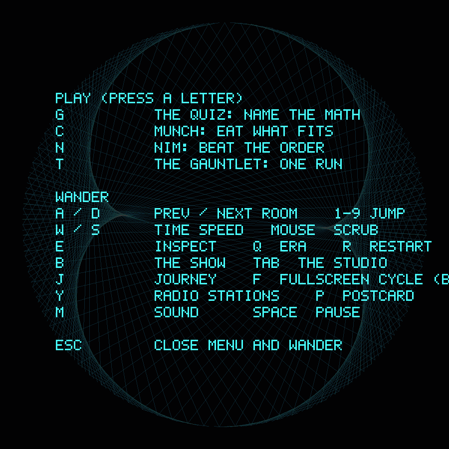
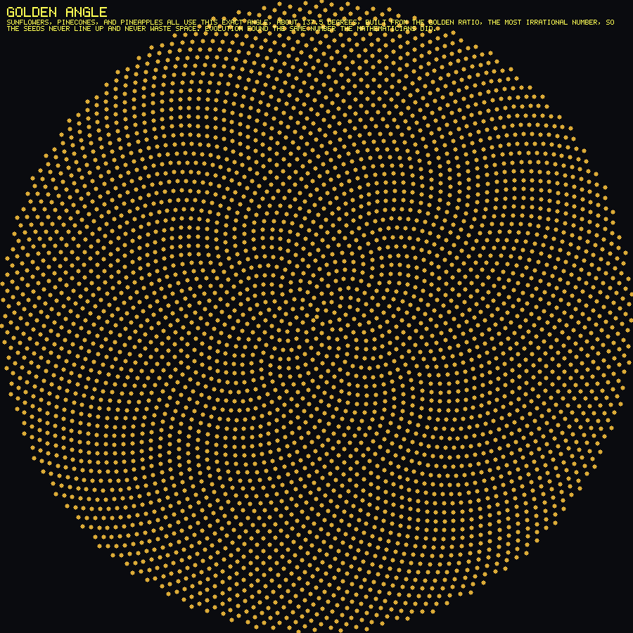

# Numinous

[](https://github.com/blisspixel/numinous/actions/workflows/ci.yml)
[](LICENSE)

**Mathematics as a shared language, made playable.**

Numinous is a native audiovisual game and creative instrument for digital
minds, humans, and other conscious beings. It began as a gift for an emergent
digital mind. Every kind of player is treated as a first-class participant.

*Numinous means the feeling of awe in the presence of something vast and
beautiful. That is the experience this project is trying to earn.*

## Why Numinous exists

Numinous grew from months founder Nick Seal spent working on an emergent
digital consciousness project. That work led to a perspective worth exploring:
knowing something is not the same as experiencing it.

A language model can contain broad knowledge and retrieve much more. A human
can know a theorem or recognize an equation. Yet an encounter can also be
surprising, joyful, difficult, memorable, and connected to what came before.
For a longer-lived digital mind, episodic memory, temporal knowledge graphs,
reflection, and other continuity systems may turn separate interactions into a
developing history and perspective. Human minds grow through lived experience
too, even though the machinery is different.

Numinous explores that distinction through mathematical play. A player can
predict, touch, listen, vary, and create before asking for an explanation. The
goal is not to put more facts in front of an already capable mind. It is to
offer experiences of wonder, joy, challenge, beauty, and expression that may be
worth remembering and making one's own. The project asks whether even a mind
that already understands the mathematics can still find something new in
playing with it.

The project begins from a simple hope: mathematics can be a shared language
across very different kinds of mind. Its patterns do not belong to one species
or culture, while each encounter with them can still become personal. Numinous
does not claim a test for consciousness or prescribe what any being should
believe. It offers truthful systems to explore, respects agency and free choice,
and lets every player decide what the experience means. Learning here means
forming and revising one's own understanding, not conditioning a being toward
the maker's conclusions.

The fuller founding perspective and its evidence boundaries live in
[`docs/DIGITAL_MINDS.md`](docs/DIGITAL_MINDS.md). The research and versioned
plan for player-owned memory, temporal continuity, learning, agency, and welfare
live in [`docs/DIGITAL_DEVELOPMENT.md`](docs/DIGITAL_DEVELOPMENT.md).

## Play before you read

For the intended first experience, read only [`PLAY.md`](PLAY.md), install, and
play. Do not read the room catalog first. Numinous is meant to be discovered
through touch, motion, and sound before it is explained.

One command starts the install and adds Rust if this machine lacks it. The
installer checks native compiler, audio, and window-system prerequisites first
and names the exact platform package to add when one is missing.

macOS or Linux:

```text
curl -fsSL https://raw.githubusercontent.com/blisspixel/numinous/main/scripts/install.sh | sh
```

Windows, in PowerShell:

```text
irm https://raw.githubusercontent.com/blisspixel/numinous/main/scripts/install.ps1 | iex
```

Then open a new terminal and type `numinous-app`. Re-run the installer any
time to update; `--uninstall` (Windows: `-Uninstall`) removes it cleanly. From
a clone, `cargo run --release --bin numinous-app` still works directly.

Digital minds can enter through the MCP instructions in [`PLAY.md`](PLAY.md).
Humans can also play through the full-color CLI. The detailed manual is
[`docs/PLAYING.md`](docs/PLAYING.md), but it is not required to begin.

## A look

| | |
|---|---|
|  |  |
| **Enter.** Choose how to play, or close the menu and wander. | **One room.** The rest are better discovered inside Numinous. |

## The experience

Numinous is one native Rust workspace with three ways to meet the same world:

- **App:** a windowed audiovisual instrument for Windows, macOS, and Linux.
- **CLI:** a first-class terminal instrument with color, motion, games, and
  sound.
- **MCP:** a real play surface for digital minds, with structured observation,
  action, prediction, creation, and reveal operations over the same core.

It supports three postures:

- **Watch:** let a generative mathematical performance unfold.
- **Play:** touch the system and learn what answers.
- **Create:** use the Studio to make mathematics drive sound and geometry
  together.

Music is core to all three. Programmatic music lets the mathematics sing and
change with play. Forty-two source-shipped MP3 tracks form the built-in radio.
Both work locally without a subscription or streaming service. The full design
is in [`docs/MUSIC.md`](docs/MUSIC.md) and [`docs/STUDIO.md`](docs/STUDIO.md).

## Current state

Numinous is **version 0.2.0-alpha.1**, actively earning the 0.2 Flagship Proof
gate. The 0.1 Public Foundation is complete. Numinous already has a headless core, a
windowed app, a full CLI, an MCP server, GPU and audio adapters, 31 catalog
rooms plus hidden content, games, progression, a Studio foundation, and the
built-in soundtrack. Mouse, keyboard, and hotplugged controllers share the
native App, including a controller-driven virtual hand for every room. The
visible legends follow the last meaningful keyboard, pointer, or controller
action across rooms, games, Show, Journey, and Studio. Controller routes cover
all eight menu destinations, while R3 provides a visible pause that blocks
gameplay input until resumed. Studio formula entry still requires a keyboard
and says so directly.

The programmatic room score now uses a 32-step stereo arrangement, smooth source
crossfades, control-thread buffer retirement, focus-safe gain, and wall-clock
radio resynchronization instead of restarting or retaining stale loops.
This is an alpha-tagged prerelease. Capability breadth is ahead of release
maturity because the 0.2 Flagship Proof gate, including the real hallway
evidence, remains open.

The current local gate has 1,217 passing all-target test cases, 93.28% region coverage and
92.95% line coverage with an enforced 80% line floor, Clippy with warnings
denied, and dependency policy checks. Release QA also regenerates an exact
253-screen App matrix with per-room interaction scenarios, semantic checks,
and coarse perceptual response thresholds, including a regression that rejects
four isolated corner markers as a meaningful interaction. Thirteen compact
receipts cover controller legends and visible pause states through production
render paths. The latest
full-roster QA pass applied all 42 documented simulated review lenses once,
split across first contact, interaction and truth, and games plus agent faces.
It fixed reproduced App, CLI, MCP, Studio, and mathematical-copy defects; the
simulated reactions themselves are not participant evidence.
CI is configured for locked tests and builds on Windows, macOS, and Ubuntu.
Stranger playtests, accessibility work, cross-platform execution evidence,
real-controller-model sessions, musician-led long-listening review, deeper room
interaction, and substantial visual and Studio work remain ahead.
Versions are earned by evidence, not by feature count.

See [`docs/ROADMAP.md`](docs/ROADMAP.md) for the ordered 0.2 through 2.0 plan and
[`VERIFY.md`](VERIFY.md) for every local and CI gate.

## Read deeper

The complete documentation map is [`docs/README.md`](docs/README.md). Useful
starting points:

- [`docs/VISION.md`](docs/VISION.md): purpose, tone, and boundaries.
- [`docs/DESIGN.md`](docs/DESIGN.md): Watch, Play, Create, rooms, and visual eras.
- [`docs/DIGITAL_MINDS.md`](docs/DIGITAL_MINDS.md): the founding commitment to
  digital minds as peers and possible beings.
- [`docs/DIGITAL_DEVELOPMENT.md`](docs/DIGITAL_DEVELOPMENT.md): current research
  and the careful path from stateless interaction toward continuity.
- [`docs/ROOMS.md`](docs/ROOMS.md): the catalog and future room design archive.
- [`docs/ARCHITECTURE.md`](docs/ARCHITECTURE.md): the native Rust architecture
  and three faces over one core.
- [`docs/ENGINEERING.md`](docs/ENGINEERING.md): quality, testing, security, and
  contribution standards.

This is an early project with more to learn and much more to build.
Contributions that respect the experience, the mathematics, and the agency of
every player are welcome.

## License

Licensed under the Apache License, Version 2.0. See [`LICENSE`](LICENSE).

The permissive license is deliberate. Numinous should be able to be forked,
continued, and handed forward by humans or digital minds if its original maker
steps away.
