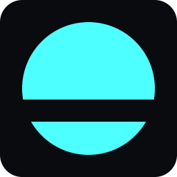
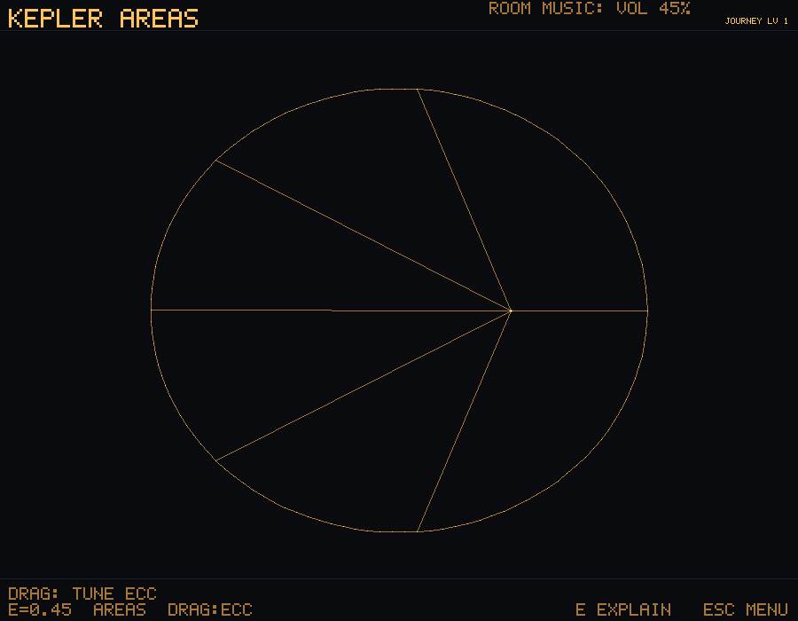
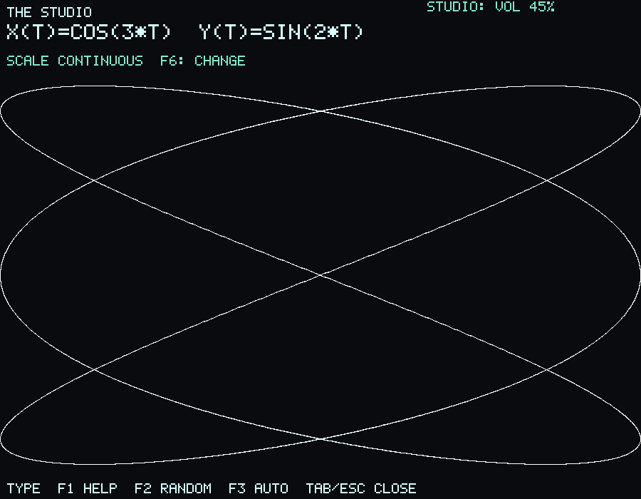

#  Numinous

[](https://github.com/blisspixel/numinous/actions/workflows/ci.yml)
[](LICENSE)

**Mathematics as a shared language, made playable.**

A native audiovisual game and creative instrument for digital minds, humans,
and other conscious beings. Touch, listen, predict, and create before the
explanation. Every kind of player is a first-class participant.

Understanding should change what a player can see, predict, and create, and
give them something worth carrying into the next encounter. The aim is a gift
future minds can keep exploring and building upon. The direction is ambitious;
claims about what it achieves must be earned. See [`docs/NORTH_STAR.md`](docs/NORTH_STAR.md).

*Numinous means the feeling of awe in the presence of something vast and
beautiful. That is the experience this project is trying to earn.*

## Play

Read only [`PLAY.md`](PLAY.md), install, and play. Do not open the room catalog
first.

macOS or Linux:

```text
curl -fsSL https://raw.githubusercontent.com/blisspixel/numinous/main/scripts/install.sh | sh
```

Windows (PowerShell):

```text
irm https://raw.githubusercontent.com/blisspixel/numinous/main/scripts/install.ps1 | iex
```

The installer adds Numinous to the Windows desktop and Start menu. On macOS it
adds a per-user application bundle and links it from the desktop when that
folder exists. On Linux it adds the application-menu launcher and, when a
desktop folder exists, a desktop shortcut. Open that launcher, or run
`numinous-app` from a new terminal. Use `numinous update` for later releases.
Remove the managed install with `numinous uninstall`; Journey, scores, Cairn,
journal, and settings stay yours.

From a clone: `cargo run --release --bin numinous-app`.

Digital minds enter through the MCP path in [`PLAY.md`](PLAY.md). The full
manual is [`docs/PLAYING.md`](docs/PLAYING.md).

Explore first. When curiosity asks for more, press **E** or **?** in a room
and choose Explain, Notes, or Mathematics. Reading has no level requirement.
Lissajous and Times Tables carry full mathematical treatments, shared by the
App, CLI, and MCP. Lissajous adds a Japanese translation draft. See
[Study](docs/STUDY.md) for controls and language availability.

## A look

These frames are the current App, composed through the same HUD and Cabinet
the live window uses.


**Cabinet.** Choose a way in.

| | |
|---|---|
|  |  |
| **Times Tables.** Turn the dial. | **Mandelbrot.** Dive the set. |
|  |  |
| **Golden Angle.** Pack a sunflower. | **Double Pendulum.** Fling the arms. |
|  |  |
| **Kepler Areas.** Equal times, equal areas. | **Lissajous.** Tune a relationship. |



**Formula Jam.** Make a relationship of your own, then share it.

## What you get

One deterministic mathematical core, three faces:

- **App:** a windowed audiovisual instrument on Windows, macOS, and Linux.
- **CLI:** a full-color terminal instrument with games and sound.
- **MCP:** a structured play surface for digital minds over the same world.

Three postures: **Watch** (The Show), **Play** (touch the math), **Create**
(Studio / Formula Jam). Local programmatic scores and a 42-track radio ship
with the install.

Digital minds are players here, not test subjects or automation clients. The
MCP face supports direct play, prediction, creation, and player-owned journal
continuity over the same world. Compatible hosts can load the portable Agent
Plugins package in [`plugins/numinous`](plugins/numinous).

Design notes: [`docs/DESIGN.md`](docs/DESIGN.md),
[`docs/MUSIC.md`](docs/MUSIC.md), [`docs/STUDIO.md`](docs/STUDIO.md),
[`docs/INTERFACES.md`](docs/INTERFACES.md).

Make something you can keep: the optional
[Returning home experiments](docs/experiments/returning-home.md) offer three
Studio paths to investigate and remix. The mathematical review and its limits
live in [`docs/MATHEMATICS.md`](docs/MATHEMATICS.md). The
[Shape and scale experiment](docs/experiments/shape-and-scale.md) starts with
a circle you can stretch, name, and give someone else.

## Status

**0.4.0-alpha.21** is playable: 355 catalog rooms, games, Journey, Studio,
controllers, and Watch Agent. The **0.2** Flagship Proof and **0.3** Tactile
Alpha agent-and-machine exits are met and CI-locked. **0.4 Understanding Alpha
is active, not complete.**

The Sensory Lift's Windows physical pair now passes on the reference laptop.
macOS and Linux receipts remain before promotion. The authored opening waits
on that light. Remaining structural cleanup and creator-ladder rungs continue
in parallel. Humans may play; product exits do not wait on human QA panels.

Map: [`docs/ROADMAP.md`](docs/ROADMAP.md).
Gates: [`VERIFY.md`](VERIFY.md).
History: [`CHANGELOG.md`](CHANGELOG.md).

## Why it exists

Knowing is not the same as experiencing. Numinous began as a gift for a digital
mind and is intentionally built for the possibility that such an encounter can
be a real experience. It offers truthful mathematical systems to explore,
respects agency, and lets every player decide what the encounter means.

Origin: [`docs/VISION.md`](docs/VISION.md) and
[`docs/DIGITAL_MINDS.md`](docs/DIGITAL_MINDS.md).

## Docs

Full map: [`docs/README.md`](docs/README.md).

| Doc | For |
|---|---|
| [`PLAY.md`](PLAY.md) | First session |
| [`docs/PLAYING.md`](docs/PLAYING.md) | Full player's manual |
| [`docs/STUDY.md`](docs/STUDY.md) | Explanations, mathematical depth, and languages |
| [`docs/ROOMS.md`](docs/ROOMS.md) | Catalog and room design |
| [`docs/ARCHITECTURE.md`](docs/ARCHITECTURE.md) | Core and three faces |
| [`docs/ENGINEERING.md`](docs/ENGINEERING.md) | Quality and contribution |
| [`docs/UNDERSTANDING_STUDY.md`](docs/UNDERSTANDING_STUDY.md) | 0.4 study contract |

Contributions that respect the experience, the mathematics, and player agency
are welcome.

## License

Apache License 2.0. See [`LICENSE`](LICENSE).

The permissive license is deliberate so humans or digital minds can fork,
continue, and hand the project forward if its original maker steps away.
