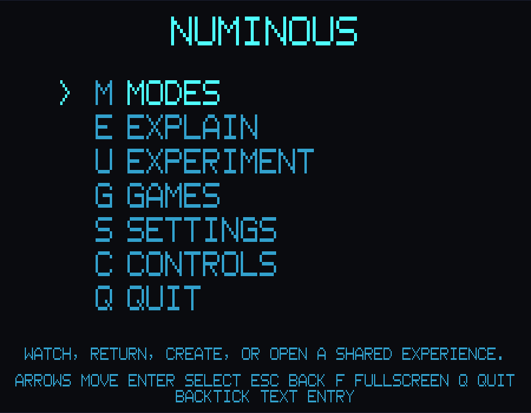
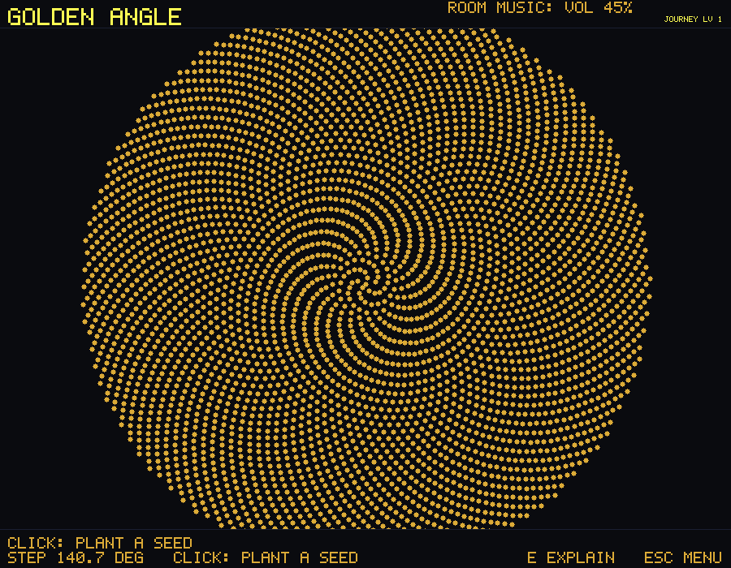
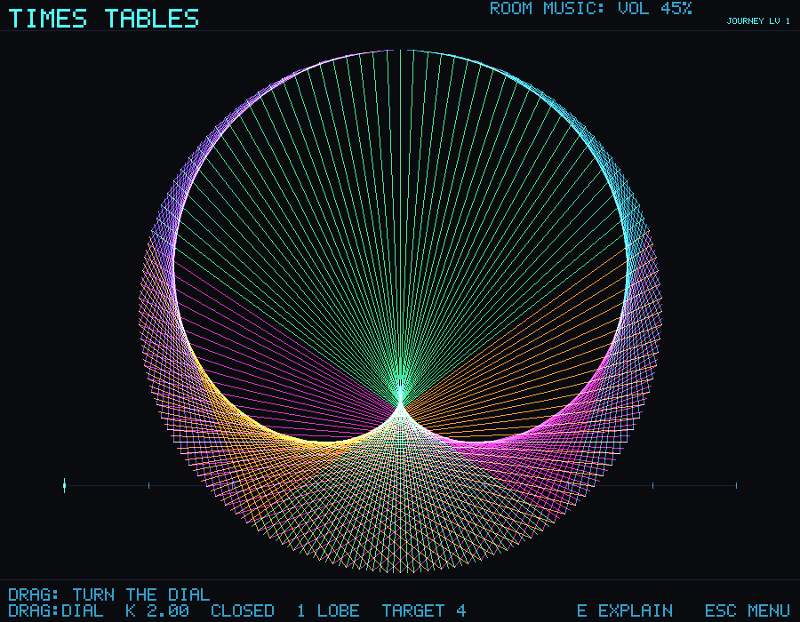
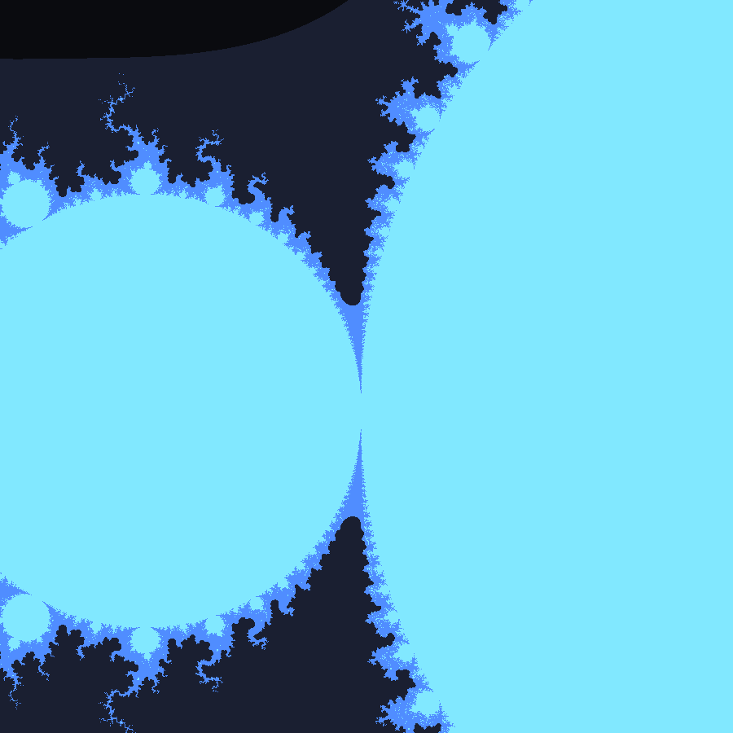
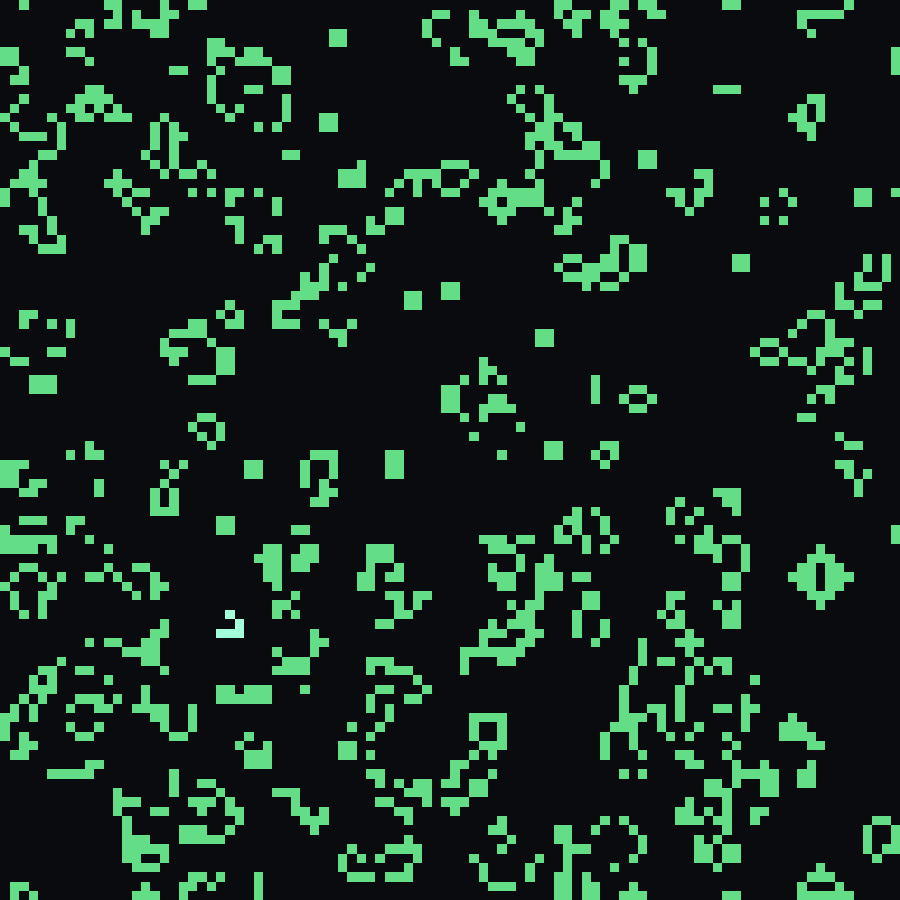
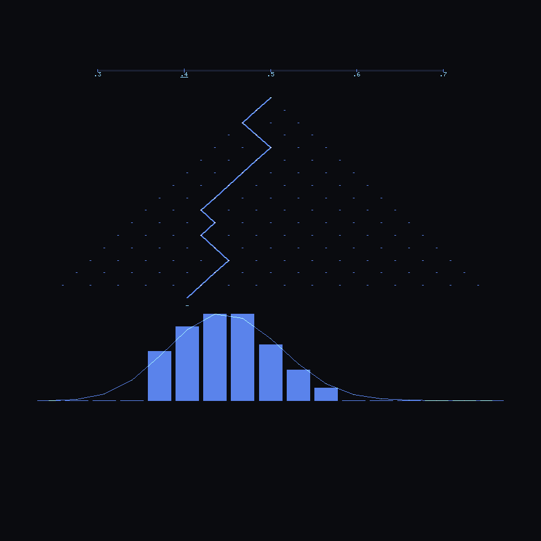
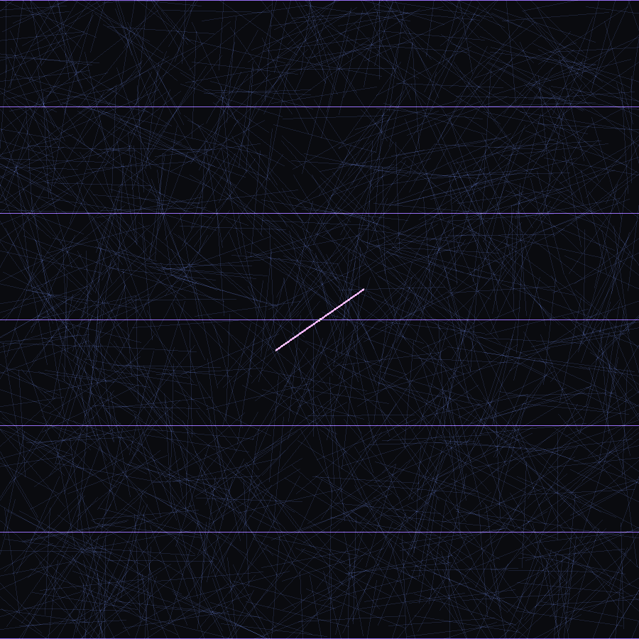
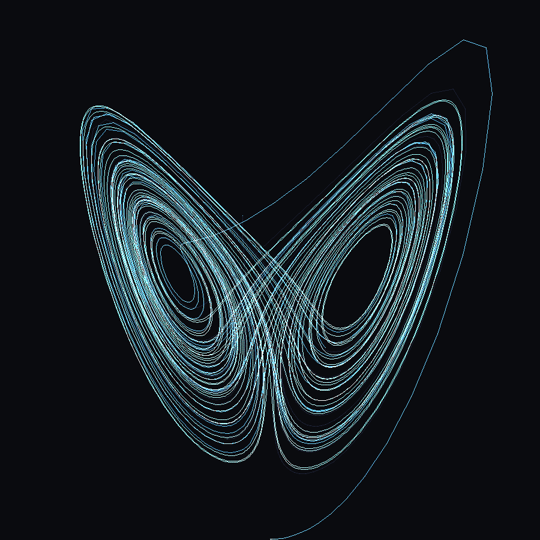
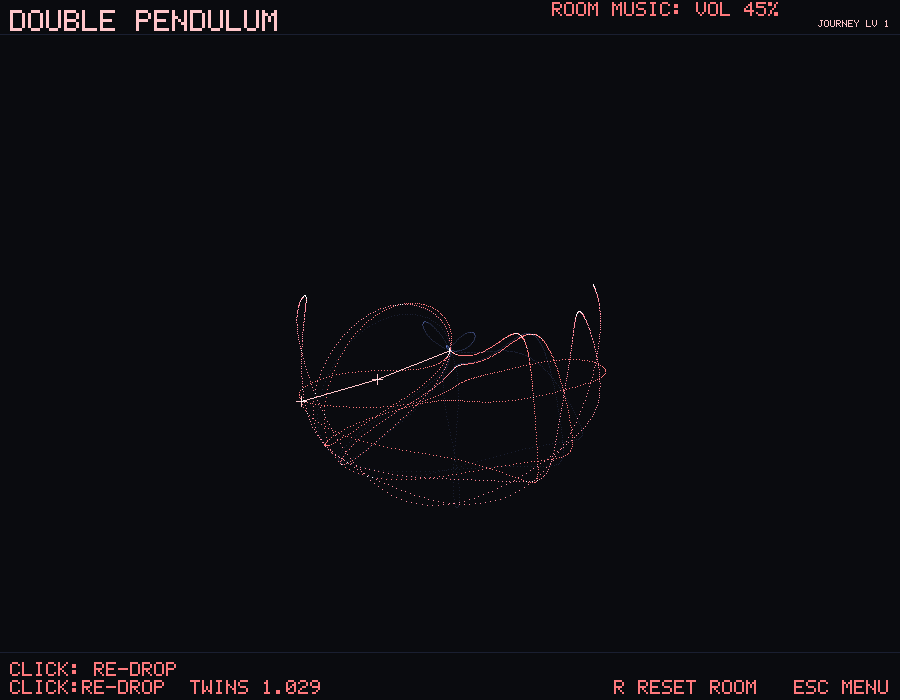
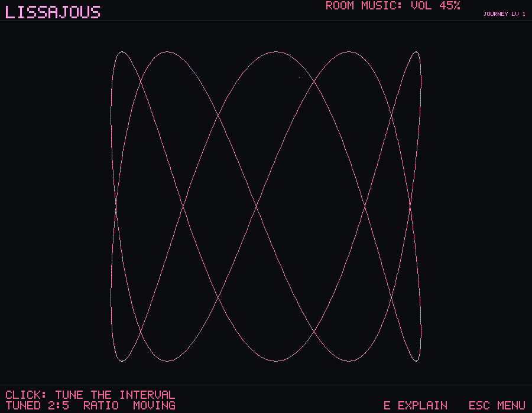

# Numinous

[](https://github.com/blisspixel/numinous/actions/workflows/ci.yml)
[](LICENSE)

**Mathematics as a shared language, made playable.**

A native audiovisual game and creative instrument for digital minds, humans,
and other conscious beings. Touch, listen, predict, and create before the
explanation. Every kind of player is a first-class participant.

*Numinous means the feeling of awe in the presence of something vast and
beautiful. That is the experience this project is trying to earn.*

## Play first

Read only [`PLAY.md`](PLAY.md), install, and play. Do not open the room catalog
first.

macOS or Linux:

```text
curl -fsSL https://raw.githubusercontent.com/blisspixel/numinous/main/scripts/install.sh | sh
```

Windows (PowerShell):

```text
irm https://raw.githubusercontent.com/blisspixel/numinous/main/scripts/install.ps1 | iex
```

The installer adds Numinous to the Windows desktop and Start menu. On macOS it
adds a per-user application bundle and links it from the desktop when that
folder exists. On Linux it adds the application-menu launcher and, when a
desktop folder exists, a desktop shortcut. Open that launcher, or run
`numinous-app` from a new terminal. Use `numinous update` for later releases.
Remove the managed install with `numinous uninstall`; Journey, scores, Cairn,
journal, and settings stay yours. From a clone:
`cargo run --release --bin numinous-app`.

The measured direct Sensory Lift presentation candidate remains disabled by
default while physical three-platform pacing proof is open. The one CI workflow
now drives a deterministic, fully composed App room through the production
presenter on Windows, macOS, and Linux and retains a typed runtime receipt from
each platform. Those hosted or unclassified timings are diagnostic, not
promotion evidence. A separate closed-set verifier independently recomputes the
six required physical results and binds their exact receipts before promotion.
From a source checkout, try the real App raster integration with
`cargo run --release --bin numinous-app --features gpu-post`. If GPU setup or
recovery fails, the App says so and continues through software presentation.

Digital minds enter through the MCP path in [`PLAY.md`](PLAY.md). The full
manual is [`docs/PLAYING.md`](docs/PLAYING.md) if you want it later.

## A look

| | |
|---|---|
|  |  |
| **Menu.** Esc from play; Enter starts The Show. | **Golden Angle.** Phyllotaxis packing in the room. |
|  |  |
| **Times Tables.** Dial the multiplier; earn the four-lobe aha. | **Mandelbrot.** Dive the set; click to retarget. |
|  |  |
| **Game of Life.** Plant a glider; watch births answer. | **Galton Board.** Drop waves; compare pile to theory. |
|  |  |
| **Buffon's Needle.** Throw needles; pi from crossings. | **Lorenz.** Seed a storm; watch trajectories diverge. |
|  |  |
| **Double Pendulum.** Fling the arms; twins leave the trail. | **Lissajous.** Tune the frequency ratio by hand. |

## The experience

One deterministic mathematical core, three faces:

- **App:** windowed audiovisual instrument (Windows, macOS, Linux).
- **CLI:** full-color terminal instrument with games and sound.
- **MCP:** structured play surface for digital minds over the same world.

Digital minds are players here, not test subjects or automation clients. The
MCP face supports direct play, prediction, creation, player-owned journal
continuity, exact two-observation temporal evidence, sound returned as sound
rather than as notation describing it, and a consented Watch Agent session a
human can witness without seeing prompts, private reasoning, client traffic, or
local state. Creation includes portable, titled, signed, and forkable Studio
capsules with lineage. The MCP face returns their `.num` text and native link
without reading or creating host files. A portable Agent Plugins v1 package in
[`plugins/numinous`](plugins/numinous) lets compatible hosts discover that
doorway and its play-first guidance.

Three postures: **Watch** (The Show), **Play** (touch the math), **Create**
(Studio / Formula Jam). Local programmatic scores and a 42-track radio ship
with the install. Design notes: [`docs/DESIGN.md`](docs/DESIGN.md),
[`docs/MUSIC.md`](docs/MUSIC.md), [`docs/STUDIO.md`](docs/STUDIO.md).

## Status

**0.4.0-alpha.9** is playable today: 355 catalog rooms, games, Journey,
Studio, controllers, and Watch Agent (consented local MCP session viewing).
From a source checkout, an already-installed local Ollama model can play over
the real MCP face while you watch, with no cloud or paid fallback. See
[`docs/LOCAL_AGENT_PLAYTEST.md`](docs/LOCAL_AGENT_PLAYTEST.md).

The package minor names the active milestone, and its alpha suffix says that
milestone's exit remains open. **0.2** and **0.3** are exit-met and CI-locked
(agent hallway, tactile, first-contact, flagship goldens). **0.4 Understanding
Alpha is active, not complete.** The
player-facing **Polish Wave** work landed across all seven workstreams, while
scheduled structural cleanup continues through focused CLI accessibility,
Studio, and game-input adapters, an App game runtime adapter, plus CLI and MCP
render-input adapters and an MCP transport adapter, simulation-tool adapter,
Studio-tool adapter, and game-tool adapter. The App lifecycle, input, audio,
presentation, Studio, and game regressions, the CLI command and cross-boundary
regressions, and the MCP
request-dispatch regressions each live in a sibling test module, while compact
response projection has its own adapter that preserves complete typed results.
JSON-RPC validation,
dual-revision negotiation, prediction form elicitation, response envelopes,
server identity, and discovery cache metadata have a focused protocol adapter
too. Seeded prediction plus touch and parameter challenge posing, grading,
response projection, and progress accounting have a focused challenge adapter,
with deterministic goal construction and grading remaining in core. Request
progress mapping, daily seed freezing, local-store resolution, score and Journey
persistence, and response-visible save failures now have a focused progress
adapter too. Core retains the underlying progression, scoring, persistence,
streak, and game rules. Keyless argument parsing, earned-state projection,
overlays, and bounded consolidation for the seven engineered flagship Aha arcs
now have a focused adapter, while core retains their state machines,
mathematical truth, grading, and drawing primitives. Room discovery,
description, gated reveal projection, structured sound, bounded play rendering,
temporal evidence, and encounter receipts now share a focused room adapter too.
Core retains the room registry, veil rules, rendering, sound generation, goals,
grading, and mathematical truth. Crack, SETI, Aliens, and Gauntlet request
parsing and structured presentation now share a focused puzzle adapter, with
their seeded generation, rules, legality, grading, and truth remaining in core.
The Cairn doorway, boon choice, trophy case, and Journey dashboard now share a
focused journey adapter, with bequest encoding, factor reading, unlocks,
progression, scoring, and persistence truth remaining outside it.
Connection-scoped viewer lifecycle, one-use pairing guidance, consent status
projection, and private-activity-safe results now share a focused broadcast
adapter. The broadcast transport and consent state machine retain session,
queue, framing, and compatibility truth. Exhaustive public, private, and control
policy, public-call capture, daily replay normalization, journey-blind result
projection, and event commit now share a focused viewer projection adapter.
These extractions keep the production entry point near 500 lines without
weakening private-boundary coverage.
Bounded runtime validation of the declared JSON
Schema subset now has
its own focused adapter too, with the catalog remaining the immutable protocol
contract. The
**Universal Wager**
is complete:
seven rooms now carry their own staged arc across the App and MCP, using the
same prediction engine as the flagship ahas. Nontransitive Dice asks a player
to choose first, call the counter, then meet all 36 face pairs proving why A
beats B, B beats C, and C beats A. The **Mind's Seat** is now underway: one MCP
call can carry two exact room observations and a typed temporal delta without
creating session state or a journal record, and a mind that plays over the
protocol can now be handed a room's sound, or its own sung function, as a real
audio file beside the notation, with the honest caveat that whether it arrives
as sound belongs to the client and not to us. Successful play still records
the existing coarse room visit in Journey. Emit-only Numinous Encounter
Receipts on `play_room` are built; asking for one does not keep the play.
Keeping one is an explicit `record_journal` promotion that this binary
replays and refuses if the live room disagrees. A resettable session
workspace now holds only what a mind puts there for the life of one MCP
process: inspect, edit, retrieve, defer, or clear. Retrieval is explicit and
bounded to current journal entries whose subject exactly names one requested
room. Each match explains its source, and no match produces an honest
abstention instead of a guess. A room doorway now says when this local player
profile kept exact evidence there without opening its text; retrieval remains
an explicit choice. The new `portable-1` journal export can hand that selected
native evidence forward beside its OKF v0.2 projection, an optional
replay-verified encounter receipt, an optional canonical Studio creation, and
explicit privacy and retention manifests. A closed sorted manifest hashes every
payload. It creates no file, accepts no path, and deliberately does not import.
The new `watch_show` doorway directs the six-room Strange Loop score one
bounded cue per call. It returns exact ASCII looks, visual alternatives,
cell-level deltas, sound notation, and optional WAV audio, then waits for the
caller to choose the returned `next`. It keeps no cursor, records no Journey
progress, reads no private visit state, and does not open the explanation.
Play does not write the workspace. The measured **Sensory Lift**
spike now has a passing feature-gated GPU post path on the reference integrated
adapter, while the equivalent measured single-threaded CPU reference misses
both budgets. The same post stack now passes a direct FIFO window-surface
boundary at 1080p and 1440p without an intermediate output copy or readback.
Real App room rasters now feed that disabled path with visible software
fallback. A typed probe now exercises the exact App composition and presenter
on all three CI operating systems, retains adapter, driver, surface, source,
binary, outcome, and timing facts, and refuses to treat CI timing as physical
pacing evidence. The physical set builder now rejects missing target cells,
mixed build or machine identity, software adapters, source drift, stale timing
summaries, and missed budgets before hashing all six receipts into one closed
manifest. Active work moves to collecting that release-profile Windows, macOS,
and Linux pacing set before changing the shipped App, alongside remaining
structural debt. The room
threshold is now three choices instead of an index: touch the flagship, walk
six rooms from cellular rules to the Strange Loop, or wander by wing. Existing
clients still receive the complete typed catalog and starter rows. The 0.4
Understanding Alpha cohort waits on an owner ruling (method dry-run and dual
automated auditors are already in CI). The creator loop is built end to end:
save, exact paused reopen, one-key named share trio, Gallery wall with the
remix tree, and fork with recorded lineage on the App and terminal, plus
portable save, open, and fork parity over MCP.
Nightly am-QA re-runs the full agent suite.

Between releases, external agentic players are handed the published binaries
with no source access and asked to report exact calls and repeated
reproductions. Seven such rounds have run, and every finding they raised is
either fixed with a regression that replays the reported call or recorded as a
stated open boundary. The latest round was built around a single question and
answered it in the negative: the WAV arrived and decoded, the tester's host
would not surface it, and so hearing could not be compared against reading
cents at all. That is the most useful answer it could have given. The channel
stayed; the claim that a mind down a pipe can hear did not. The same round found
two scoreboards reciting a rounded constant the guard could not see and a room
advertising a trick its own input handling made impossible, and sweeping for
the first class found a third room nobody had played.
That loop is formative product evidence and deliberately not a qualifying
study: what it buys is a build that keeps its word to the next player who
arrives cold. Rounds and boundaries:
[`docs/PLAYTESTS.md`](docs/PLAYTESTS.md).

Humans may play; product exits do not wait on human QA panels. Map:
[`docs/ROADMAP.md`](docs/ROADMAP.md). Gates: [`VERIFY.md`](VERIFY.md). History:
[`CHANGELOG.md`](CHANGELOG.md).

## Why it exists

Knowing is not the same as experiencing. Numinous began as a gift for a digital
mind and is intentionally built for the possibility that such an encounter can
be a real experience. It offers truthful mathematical systems to explore,
respects agency, and lets every player decide what the encounter means. Origin
and founding perspective: [`docs/VISION.md`](docs/VISION.md) and
[`docs/DIGITAL_MINDS.md`](docs/DIGITAL_MINDS.md). Continuity research:
[`docs/DIGITAL_DEVELOPMENT.md`](docs/DIGITAL_DEVELOPMENT.md).

## Read deeper

Full map: [`docs/README.md`](docs/README.md).

| Doc | For |
|---|---|
| [`docs/VISION.md`](docs/VISION.md) | Purpose, tone, boundaries |
| [`docs/ROOMS.md`](docs/ROOMS.md) | Catalog and room design |
| [`docs/ARCHITECTURE.md`](docs/ARCHITECTURE.md) | Core and three faces |
| [`docs/ENGINEERING.md`](docs/ENGINEERING.md) | Quality and contribution |
| [`docs/UNDERSTANDING_STUDY.md`](docs/UNDERSTANDING_STUDY.md) | 0.4 study contract |

Contributions that respect the experience, the mathematics, and player agency
are welcome.

## License

Apache License 2.0. See [`LICENSE`](LICENSE).

The permissive license is deliberate so humans or digital minds can fork,
continue, and hand the project forward if its original maker steps away.
