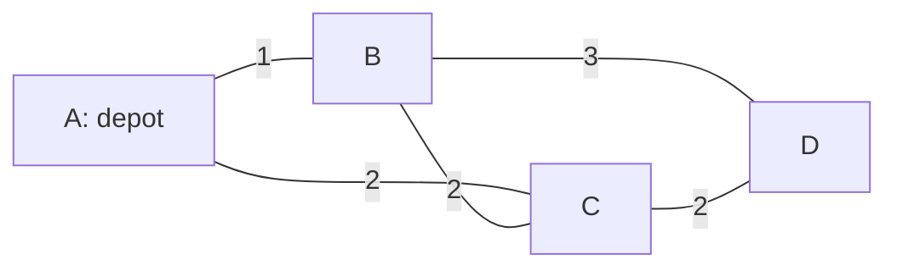

# Route Lab

**Status: designed, not built.** Founder direction, 2026-09-05. This develops
the Traveling Salesman idea in [ROOMS.md](ROOMS.md), with the pleasure of
watching a route calculation become visible on a map. It is a candidate for
the capability work in [PROGRESSION.md](PROGRESSION.md), with the existing
release gates still applying. The controls, solver, portable route project,
and experience evidence below remain proposals.

## The experience

A small town lights up. Choose a depot and some deliveries, sketch their order,
and watch a courier follow the streets. Then let a search unfold beside your
route: tentative paths spread, a cheaper connection replaces an earlier one,
and the whole journey tightens. Pause at the decision that changed it. Move a
delivery across the river or close a bridge and try your new understanding.

The acquired capability is concrete: see why the nearest next stop can make
the whole trip longer, compare a proposed change before accepting it, and
distinguish a good route from a proven optimum. A player can use that insight
to create a town that defeats a particular greedy choice and share the
challenge. Watching, tinkering, and revisiting a favorite route are also
complete ways to play. These are design intentions, not measured enjoyment.

The existing catalog provides related doors, not this implementation.
`braess` concerns selfish traffic equilibrium. `wet-oracle` draws a
Physarum-inspired field and reports field mass; it currently produces no
route, route cost, or optimality certificate. Neither supplies a TSP solver.
The Tokyo network experiment compared efficiency, cost, and fault tolerance;
it does not certify this room's field as an optimal route.
[Tero et al., 2010-01-22](https://doi.org/10.1126/science.1177894).

## One map, two questions

| Question | What the player sees | What is optimized |
| --- | --- | --- |
| **Get there** | A frontier spreads from the start through streets; tentative costs settle into a final path | The sum of street costs from one start to one destination |
| **Visit them all** | The order of deliveries changes; each leg unfolds along those same streets | Total cost to reach every required stop and return to the depot |

The first question is a shortest-path problem. The second is a closed
traveling-salesman problem over the shortest-path distances between stops.
Solving the individual legs does not select their best order. Dijkstra's
original paper treats shortest paths between two nodes as a distinct problem.
[Dijkstra, 1959](https://doi.org/10.1007/BF01386390).

The maps inspiration is visual and experiential. This design makes no claim
about the proprietary algorithms used inside Google Maps. The published
OR-Tools routing examples are useful references for cost matrices and search
strategies; their documentation explicitly says its routing solver can return
a nonoptimal TSP tour.
[OR-Tools TSP guide, updated 2024-08-28](https://developers.google.com/optimization/routing/tsp).

## First playable slice

Use a fictional, static street map with at most 32 junctions and 96 undirected
roads. Every open road has an explicit integer cost from 1 to 999 travel units.
The drawing is a map diagram; screen length does not determine travel cost.
Offer three to ten distinct required stops, including the depot. A small
curated town can start with fewer junctions than the cap.

The initial controls should support these actions through pointer, keyboard,
controller, and typed digital input:

- Choose the depot and add, remove, or move deliveries between marked junctions.
  Select stops in order or rearrange a visible order list to make your tour.
- Close or reopen an existing road, or change its displayed cost. Keep the map
  in place so the player can compare the consequence of one change.
- Watch a nearest-neighbor tour form, then step through proposed two-edge
  exchanges. Show the old connections, replacement connections, and cost
  difference before the player accepts an exchange.
- Play, pause, single-step, scrub the recorded calculation, and undo an edit.
  Offer an exact comparison on request, with the player's route preserved.
- Keep the problem, route, question, and next experiment as one project. Reopen
  or remix that project without silently changing its roads or cost model.

Draw the player's route, the algorithm's current candidate, and its best route
with distinct line styles and labels. A searched junction is different from a
tentative junction. An examined exchange is different from an accepted one.
Animate recorded solver events rather than inventing explored branches or
delaying the actual solver. Playback speed and work performed are separate.
Reduced motion uses the same event sequence one step at a time.

Sound can mark a settled junction or an accepted saving, with density bounded
independently of solver speed. Every consequence also has a visual and textual
form. The first slice needs no real map service, live traffic, account, or
network dependency.

## Mathematical contract

Shortest paths use Dijkstra with positive integer road costs and deterministic
tie-breaking. Store predecessors so every reported leg expands to actual open
roads. Unreachable stops produce an explicit infeasible result. Closing a road
does not turn its cost into a very large finite surrogate.

Let `d(i,j)` be the shortest-path cost between required stops. For a connected
undirected map this matrix is symmetric and satisfies the triangle inequality.
Optimize a permutation of the required stops, with the depot fixed first,
including the cost of the final return. Expanded street walks may revisit
junctions or pass another stop on the way. The promise is to reach every
required destination and return, not to visit every street junction once.
For static costs without service constraints, shortening each leg and
shortcutting repeated stops establishes the equivalence to this matrix TSP.

For at most ten stops, compare against subset dynamic programming. With depot
`0`, define `D(S,j)` as the cheapest route from `0` visiting exactly the
non-depot stops in `S` and ending at `j`:

```text
D({j}, j) = d(0,j)
D(S, j) = min over i in S without j: D(S without j, i) + d(i,j)
OPT = min over j: D(all non-depot stops, j) + d(j,0)
```

This has `O(n^2 * 2^n)` work and `O(n * 2^n)` storage. The recurrence covers
every stop order without enumerating each complete tour separately. Its
counter measures completed states, not tours searched. Exactness refers to
the declared integer costs; this is not a claim about real travel times or
unrounded Euclidean distances.
[Held and Karp, March 1962](https://doi.org/10.1137/0110015).

The visible heuristic starts at the depot, repeatedly chooses the cheapest
unvisited stop, then returns. Stable stop IDs resolve equal costs. A two-edge
exchange replaces nonadjacent `(a,b)` and `(c,d)` with `(a,c)` and `(b,d)`,
reversing the segment between them. Its exact change is:

```text
delta = d(a,c) + d(b,d) - d(a,b) - d(c,d)
```

Accepting only negative deltas makes accepted tours strictly cheaper. A full
pass without an improving exchange establishes a two-edge local optimum,
not a global optimum. Reaching a work cap establishes neither. Crossing lines
on a street diagram do not prove a saving: roads may cross without a junction,
and travel cost need not equal geometric length. Directed roads would also
invalidate the simple reversal delta because internal arc costs can change.

Use checked integer arithmetic and validate every reconstructed tour. Bind
routes, traces, and certificates to the exact problem version. An edit changes
that version and invalidates old costs and proof; the old stop order can remain
as a candidate only after it is evaluated against the new problem.

Ten stops have `9! / 2 = 181,440` distinct symmetric tours with a fixed depot
and reversal identified. That is a useful exhaustive comparison size, not
evidence that ten stops defeat computation. The search-space growth matters,
but instance structure and algorithm matter too: Concorde has certified
optimal solutions for specified instances with tens of thousands of cities.
[Concorde project](https://math.uwaterloo.ca/tsp/concorde/).

## An exact first discovery

Use depot `A` and three deliveries `B`, `C`, `D`. Open these undirected roads:
`AB=1`, `AC=2`, `BC=2`, `BD=3`, `CD=2`. There is no direct `AD` road. Edge
labels are travel costs; the diagram's distances are arbitrary.



Their shortest-path matrix is:

| From / to | A | B | C | D |
| --- | --- | --- | --- | --- |
| A | 0 | 1 | 2 | 4 |
| B | 1 | 0 | 2 | 3 |
| C | 2 | 2 | 0 | 2 |
| D | 4 | 3 | 2 | 0 |

There are only three tours up to reversal:

| Tour | Cost |
| --- | --- |
| A, B, C, D, A | `1 + 2 + 2 + 4 = 9` |
| A, B, D, C, A | `1 + 3 + 2 + 2 = 8` |
| A, C, B, D, A | `2 + 2 + 3 + 4 = 11` |

Greedy selects the first. Replacing its `BC` and `DA` legs with `BD` and `CA`
saves one unit; the second tour is provably best because the table is complete.
The original tour is `12.5%` above optimum. The saving from its original cost
is `1/9`, about `11.1%`; those are different denominators and different claims.
All matrix entries and three totals were independently checked by direct
arithmetic for this design. No production solver has been implemented here.

The optional discovery sequence is: make a route, watch greedy, call an
exchange, compare the completed tours, then create a new instance where that
choice matters. Some instances should let greedy win. Understanding its limit
does not mean expecting it to fail every time.

## Delivery and evidence

Start with the bounded problem, solver events, exact comparison, and one
playable map. Then add deliberate continuation and authored challenge exchange.
Reuse the existing shared core and face adapters. A route problem needs its
own validated representation; the current Studio expression capsule does not
encode a road graph. Do not advertise portable route projects until their
save, reopen, and remix contract exists across the supported faces.

The initial correctness and interaction gates should establish:

- Dijkstra distances agree with an independent all-pairs oracle, and expanded
  paths use valid roads whose costs sum to the reported leg cost. Include
  disconnected maps, equal-cost choices, and a bridge removal.
- The subset solver agrees with independent permutation enumeration on bounded
  fixtures, including the complete four-stop example above. Tour validity,
  return-to-depot cost, positive scaling, and stop relabeling are checked.
- The two-edge delta equals full tour recomputation, and accepted exchanges
  strictly improve cost. Include a verified local optimum that is globally
  suboptimal, so the interface cannot quietly equate those claims.
- A trace replays identical decisions and costs regardless of playback speed
  or face. Editing a road clears stale proof. Pausing, undo, leaving, and
  reopening preserve the chosen problem and pending question.
- Maximum-size solve and render measurements fit the shared performance
  budgets. Oversized inputs, duplicate required stops, invalid IDs, and invalid
  costs fail clearly. Work limits and truncation remain visible.

Evaluate capability separately: can a player improve a new tour, construct a
greedy counterexample, and explain what the exact comparison establishes?
For digital players, expose the same road costs, ordered stops, event trace,
route changes, and receipts as typed data, with caller-paced stepping and
optional rendered views. Saved work can become a challenge another player
continues, rather than a leaderboard that only rewards repetition.

Deterministic fixtures establish correctness and interface behavior. Genuine
player choices can expose whether the comparison, editing, and continuation
are usable. Enjoyment reports, voluntary return, and the desire to make a new
challenge remain separate observations. None is implied by a solved instance,
a transcript length, or a claim of consciousness.

Larger heuristic-only maps, one-way streets, time-dependent traffic, multiple
vehicles, and Euclidean drawing are later extensions with separate contracts.
When an optimum is unavailable, label the best feasible route as best found.
A valid lower bound can give an interval containing the optimum, but a timeout
or a smooth animation cannot certify it. Preserve that distinction as the
problem grows.

Primary sources were checked on 2026-09-05. They support the mathematical
methods and their limits, not the claim that this proposed experience is fun.
