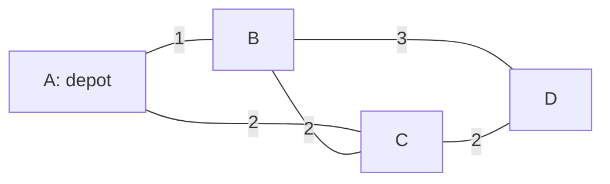

# Route Lab

**Status: the opening delivery experiment, native network authoring, portable
route creations, kept questions, bounded undo, and search playback are built.**
Founder direction, 2026-09-05. This develops
the Traveling Salesman idea in [ROOMS.md](ROOMS.md), with the pleasure of
watching a route calculation become visible on a map. It is a candidate for
the capability work in [PROGRESSION.md](PROGRESSION.md), with the existing
release gates still applying. The current room and bounded solvers are described
below. Deliberate diagram positioning, richer comparison presentation, authored
challenges, and participant experience evidence remain open.

## Choose a delivery order

Open `route-lab` in the App, CLI, or MCP. The same roads, stop order, integer
costs, and exact comparison belong to core in every face. Deliver to B, C, and D,
then return to A. The opening order is A-B-C-D-A. Drag across the main map to
choose another order; the separate BD strip changes that road's cost.
**NEAREST NEXT** builds an order by choosing the cheapest next delivery.
**USE SHORTER** accepts the cheaper order shown above the controls; **NO OFFER**
means the local reorder search found no saving, which alone does not prove the
minimum. The readout separately gives the exact best round-trip cost. Moving
across a button does not accept it. There is no penalty for a longer round trip.

The delivery order schedules the stops. The street walk connects them: each leg
uses the cheapest open road path and may pass another delivery before its turn,
or revisit a junction. Returning to A is part of the cost. This distinction
matters when interpreting the highlighted roads or a shortest-path search.

In ordinary App play, keys 1 through 6 choose an order, G uses nearest-next,
I accepts the offered shorter order, and J/L decrease or increase BD's cost within
its bounds. These local keys take priority over their ordinary shortcuts while
this room is active. Study, Cabinet, Studio, games, and The Show retain their
own input. Reset restores the visit's opening network and order.
Long App sessions preserve the selected order, road costs and closures, bounded
undo, and trace cursor through a core-owned replay checkpoint. Old pointer
samples can expire without resetting the experiment. Checkpoint events describe
state, not a physical-input receipt.

The ordinary feasible route view reports the current order, its complete
round-trip cost, the exact minimum, the saving offered by the next reorder, and
BD's cost. Search playback reports a recorded decision or result; unreachable
required stops prevent comparison. An unused isolated junction does not.
The map labels integer road costs and draws the expanded route along actual
streets. The proposal names its candidate order and saving before acceptance.
Changing BD recomputes distances, proposals, and the exact optimum; it cannot
reuse a certificate for an earlier network.

From the CLI:

```text
numinous render route-lab --width 64 --height 28
numinous render route-lab --poke 0.75,0.92
numinous render route-lab --poke 0.5,0.78
```

From MCP, call `play_room` with `id: "route-lab"`. Add
`pokes: [[0.75, 0.92]]` to accept the opening saving, or
`pokes: [[0.5, 0.78]]` to change BD to 5. Calls replay their supplied history;
to keep a previous edit, include it before the next action. The latter edit
makes the opening greedy route optimal, so greedy is a candidate to inspect,
not a universal mistake. `study_room` provides the room's explanation; the
longer treatment and recurrence below remain available to clone readers.

The native room keeps its depot and deliveries fixed. Comma and period select
a road, C closes or reopens it, Z undoes an edit, and T opens A-to-D **SEARCH**
playback. While that panel is open, comma and period move back or forward
through the recorded decisions. The visible ROAD, CLOSE/OPEN, UNDO, SEARCH/HIDE,
and BACK/STEP controls give pointer and controller users the same actions.
Costs in the search are cumulative from A: tentative costs can improve;
finalized costs are the cheapest costs to their junctions. A closed road keeps
its cost and is visibly labeled. Unreachable deliveries remain visible with
reopen and undo guidance. An edit or undo clears the old calculation; STEP
records a fresh one if the search panel is still open.

`crates/core/src/route.rs` supplies bounded positive-cost Dijkstra,
actual street reconstruction, nearest-neighbor, checked two-edge exchanges,
and exact subset dynamic programming. Its tests compare shortest paths with
Floyd-Warshall and tour optima with independent permutation enumeration,
including a case where two-edge local optimality is not global optimality.
Room, App release, CLI process, and MCP door/receipt tests cover the playable
boundary. These are correctness and functional evidence, not measured enjoyment.

## Custom street networks and continuation, built

CLI `numinous route-lab --json` and private MCP `route_lab` open the canonical
workbench. Plain `numinous route-lab` instead gives a readable comparison and
street walk. Both faces use `faces/shared/route_json.rs`; core owns every validation,
edit, route comparison, and solver event. [PLAY.md](../PLAY.md) and the packaged
skill document the request actions and followable next calls for installed players.

A request optionally supplies `snapshot` and an explicit `action`. The snapshot
contains `revision`, `current`, `undo`, and `trace`. `current` describes junctions,
roads with explicit open flags, required stops with the depot first, and the
player's delivery order. `junctions` is a count, with junction IDs from zero
through `junctions - 1`. Evaluation leaves the order intact. Road cost and closure,
required-stop, depot, and order actions advance a checked revision when state
changes. Greedy and improve deliberately construct a route. Undo restores the
last retained network under a new revision; a no-op creates no historical edit.

Structurally malformed or oversized state is refused. Structurally valid networks
with too few deliveries or unreachable stops are retained and report infeasible
comparison, so a later edit can repair the question. Closed streets are absent
from search rather than assigned a large finite cost. The native room uses the
same model for its supported edits.

Search playback starts at cursor zero and reveals recorded settling and strict relaxation
events only on a step or seek. Dijkstra completes its bounded source search when
recording; cursor movement is presentation, not work avoided. The path or an
unreachable result appears at completion. Imported cursor metadata must match
both revision and the canonical network digest, and the events are regenerated.
The digest detects inconsistent state, not authorship or independent custody.
Core `RouteTracePlayback::view` folds only the revealed prefix into current
junction costs, predecessors, and unseen, tentative, settled, or unreachable
states. The source starts with tentative zero. A settlement establishes its
minimum cost; a strict relaxation can replace an earlier tentative predecessor.
Only a completed source search establishes that an unseen junction is
unreachable. Backward seeks reconstruct the earlier view without future costs.
CLI text and additive MCP `trace.view` use that projection. The existing snapshot
format and portable creation identity stay unchanged.

Both the ordinary room and native authoring draw the search on the network.
Ordinary play dashes tentative predecessor links and doubles finalized
connections. Native authoring dashes predecessor links and marks finalized
junctions with squares. Both emphasize the latest relaxation and give the
completed path a separate heavier stroke. Junction shapes and labels distinguish
state without depending on color. Native authoring retains a selected-junction
inspector on dense and compact maps. Click a node or use the junction controls
to inspect it without advancing or restarting the recorded search. The path
appears only when playback completes. These are bounded functional and
presentation capabilities;
participant comprehension has not been measured.

The snapshot is caller-carried continuation across requests or processes.
It carries session history without a profile write. [Route state and
caller-paced calculation](decisions/0002-route-workbench.md) owns that boundary.

## Native network authoring and kept routes, built

Press O in Route Lab or choose Cabinet CONSTRUCT to enter the native editor.
View, Roads, Stops, Order, Search, and Keep use one core workbench. Add and remove
roads, adjust the junction count, change explicit costs and closures, choose
deliveries and their depot, and move deliveries earlier or later. Pointer,
keyboard, and controller input share the visible controls and hit layout.
The diagram is schematic. Road inspection reports the selected connection's
actual cost and availability; the delivery route follows core-reconstructed
streets. Invalid structural drafts are refused without replacing the network.
Each successful structural change has one undo step and clears stale search.

Leaving and returning retain the in-process workbench, including bounded undo
and playback. Baseline restores the network originally opened. Those behaviors
do not persist an unsaved editor across App exit. On Keep, enter a question and
choose KEEP QUESTION to store it beside the route in the existing project chain.
The Cabinet's THE QUESTION opens an exact kept network paused. Enter activates
editing; leaving the preview does not execute its next call or write a project.
Ordinary edits preserve a creation's existing parent, and explicit Remix creates
a child without changing its source.

SHARE on the Keep page exports the chosen question and canonical creation as
one portable `.project` document, without appending a local project revision.
The App receives route documents by drop or launch path, validates them through
core's bounded reader, and stages a paused preview. OPEN starts the received
experiment in memory. KEEP explicitly imports it through the existing project
chain and its duplicate rules. Cancel restores the interrupted session,
including its undo history and caller-paced search. Sharing uses a fresh export
filename and does not replace an existing file.

Core `RouteCreation` accepts bounded `NUMINOUS_ROUTE 1` data, preserving the
authored roads, closures, required stops, depot, and selected order. Its 8 KiB
limit applies before parsing. Opening starts revision zero with fresh undo and
search, and comparisons are recomputed. A disconnected authored network remains
portable. Canonical content and a declared parent determine identity; this is
not an authorship or custody attestation.

CLI and MCP creation actions use scalar `action: "save"`, `"open"`, or `"remix"`.
Save accepts a workbench snapshot and returns `creation.capsule`; opening and
remixing accept that capsule text. Saving edits to an existing creation accepts
both capsule and snapshot, preserving its parent. A capsule-only save preserves
that creation's network. The transport remains stateless and writes no file.
CLI `route-lab --out delivery.route` writes an explicit new export file.
CLI project keep, import, export, and JSON resume use the existing chain; MCP
`project` previews followable route calls. [PLAY.md](../PLAY.md) gives installed
players the literal commands and request fields.

Route-containing project documents and chains use version 2 headers. Studio-only
version 1 bytes and identities remain unchanged; both supported versions reopen.
Questions, evidence links, corrections, capacity limits, locking, and atomic
writes stay in the existing project and persistence owners. [Portable route
creations](decisions/0003-route-creations.md) records that choice. Core capsule,
legacy identity, mixed-chain, and persistence regressions; real CLI/MCP round
trips; followed resume calls; native lifecycle/input checks; and composed
default and compact frames support these functional claims.

## The experience

A street network lights up. Choose a depot and some deliveries, sketch their order,
and watch a courier follow the streets. Then let a search unfold beside your
route: tentative paths spread, a cheaper connection replaces an earlier one,
and the whole journey tightens. Pause at the decision that changed it. Move a
delivery across the river or close a bridge and try your new understanding.

The acquired capability is concrete: see why the nearest next stop can make
the whole trip longer, compare a proposed change before accepting it, and
distinguish a good route from a proven optimum. A player can use that insight
to create a network that defeats a particular greedy choice and share the
challenge. Watching, tinkering, and revisiting a favorite route are also
complete ways to play. These are design intentions, not measured enjoyment.

The existing catalog provides related doors, not this implementation.
`braess` concerns selfish traffic equilibrium. `wet-oracle` draws a
Physarum-inspired field and reports field mass; it currently produces no
route, route cost, or optimality certificate. Neither supplies a TSP solver.
The Tokyo network experiment compared efficiency, cost, and fault tolerance;
it does not certify this room's field as an optimal route.
[Tero et al., 2010-01-22](https://doi.org/10.1126/science.1177894).

## One map, two questions

| Question | What the player sees | What is optimized |
| --- | --- | --- |
| **Get there** | A frontier spreads from the start through streets; tentative costs settle into a final path | The sum of street costs from one start to one destination |
| **Visit them all** | The order of deliveries changes; each leg unfolds along those same streets | Total cost to reach every required stop and return to the depot |

The first question is a shortest-path problem. The second is a closed
traveling-salesman problem over the shortest-path distances between stops.
Solving the individual legs does not select their best order. Dijkstra's
original paper treats shortest paths between two nodes as a distinct problem.
[Dijkstra, 1959](https://doi.org/10.1007/BF01386390).

The maps inspiration is visual and experiential. This design makes no claim
about the proprietary algorithms used inside Google Maps. The published
OR-Tools routing examples are useful references for cost matrices and search
strategies; their documentation explicitly says its routing solver can return
a nonoptimal TSP tour.
[OR-Tools TSP guide, updated 2024-08-28](https://developers.google.com/optimization/routing/tsp).

## Further presentation, designed

The typed model already admits a fictional, static street map with at most 32
junctions and 96 undirected roads. Every open road has an explicit integer cost
from 1 to 999 travel units.
The drawing is a map diagram; screen length does not determine travel cost.
Offer three to ten distinct required stops, including the depot. A small
curated network can start with fewer junctions than the cap.

The bounded editor and portable project above establish the initial controls.
Further presentation can add deliberate junction positioning, richer road tables,
simultaneous current/proposed/best street walks, and arbitrary-source native
search. Watching nearest-next form and inspecting the specific exchanged delivery
legs should use actual recorded decisions, with a cost difference before
acceptance. Authored challenge exchange and participant experience evidence
remain separate work.

Draw the player's route, the algorithm's current candidate, and its best route
with distinct line styles and labels. A searched junction is different from a
tentative junction. An examined exchange is different from an accepted one.
Animate recorded solver events rather than inventing explored branches or
delaying the actual solver. Playback speed and work performed are separate.
Reduced motion uses the same event sequence one step at a time.

Sound can mark a settled junction or an accepted saving, with density bounded
independently of solver speed. Every consequence also has a visual and textual
form. The first slice needs no real map service, live traffic, account, or
network dependency.

## Mathematical contract

Shortest paths use Dijkstra with positive integer road costs and deterministic
tie-breaking. Store predecessors so every reported leg expands to actual open
roads. Unreachable stops produce an explicit infeasible result. Closing a road
does not turn its cost into a very large finite surrogate.

Let `d(i,j)` be the shortest-path cost between required stops. For a connected
undirected map this matrix is symmetric and satisfies the triangle inequality.
Optimize a permutation of the required stops, with the depot fixed first,
including the cost of the final return. Expanded street walks may revisit
junctions or pass another stop on the way. The promise is to reach every
required destination and return, not to visit every street junction once.
For static costs without service constraints, shortening each leg and
shortcutting repeated stops establishes the equivalence to this matrix TSP.

For at most ten stops, compare against subset dynamic programming. With depot
`0`, define `D(S,j)` as the cheapest route from `0` visiting exactly the
non-depot stops in `S` and ending at `j`:

```text
D({j}, j) = d(0,j)
D(S, j) = min over i in S without j: D(S without j, i) + d(i,j)
OPT = min over j: D(all non-depot stops, j) + d(j,0)
```

This has `O(n^2 * 2^n)` work and `O(n * 2^n)` storage. The recurrence covers
every stop order without enumerating each complete tour separately. Its
counter measures completed states, not tours searched. Exactness refers to
the declared integer costs; this is not a claim about real travel times or
unrounded Euclidean distances.
[Held and Karp, March 1962](https://doi.org/10.1137/0110015).

The visible heuristic starts at the depot, repeatedly chooses the cheapest
unvisited stop, then returns. Stable stop IDs resolve equal costs. A two-edge
exchange replaces nonadjacent `(a,b)` and `(c,d)` with `(a,c)` and `(b,d)`,
reversing the segment between them. Its exact change is:

```text
delta = d(a,c) + d(b,d) - d(a,b) - d(c,d)
```

Accepting only negative deltas makes accepted tours strictly cheaper. A full
pass without an improving exchange establishes a two-edge local optimum,
not a global optimum. Reaching a work cap establishes neither. Crossing lines
on a street diagram do not prove a saving: roads may cross without a junction,
and travel cost need not equal geometric length. Directed roads would also
invalidate the simple reversal delta because internal arc costs can change.

Use checked integer arithmetic and validate every reconstructed tour. Bind
routes, traces, and certificates to the exact problem version. An edit changes
that version and invalidates old costs and proof; the old stop order can remain
as a candidate only after it is evaluated against the new problem.

Ten stops have `9! / 2 = 181,440` distinct symmetric tours with a fixed depot
and reversal identified. That is a useful exhaustive comparison size, not
evidence that ten stops defeat computation. The search-space growth matters,
but instance structure and algorithm matter too: Concorde has certified
optimal solutions for specified instances with tens of thousands of cities.
[Concorde project](https://math.uwaterloo.ca/tsp/concorde/).

## An exact first discovery

Use depot `A` and three deliveries `B`, `C`, `D`. Open these undirected roads:
`AB=1`, `AC=2`, `BC=2`, `BD=3`, `CD=2`. There is no direct `AD` road. Edge
labels are travel costs; the diagram's distances are arbitrary.


```mermaid
graph LR
    A["A: depot"] ---|1| B["B"]
    A ---|2| C["C"]
    B ---|2| C
    B ---|3| D["D"]
    C ---|2| D
```

Their shortest-path matrix is:

| From / to | A | B | C | D |
| --- | --- | --- | --- | --- |
| A | 0 | 1 | 2 | 4 |
| B | 1 | 0 | 2 | 3 |
| C | 2 | 2 | 0 | 2 |
| D | 4 | 3 | 2 | 0 |

There are only three tours up to reversal:

| Tour | Cost |
| --- | --- |
| A, B, C, D, A | `1 + 2 + 2 + 4 = 9` |
| A, B, D, C, A | `1 + 3 + 2 + 2 = 8` |
| A, C, B, D, A | `2 + 2 + 3 + 4 = 11` |

Greedy selects the first. Replacing its `BC` and `DA` legs with `BD` and `CA`
saves one unit; the second tour is provably best because the table is complete.
The original tour is `12.5%` above optimum. The saving from its original cost
is `1/9`, about `11.1%`; those are different denominators and different claims.
All matrix entries and three totals were independently checked by direct
arithmetic. The production solver now reproduces them, with shortest-path and
exhaustive-tour reference checks in `crates/core/src/route.rs`.

The optional discovery sequence is: make a route, watch greedy, call an
exchange, compare the completed tours, then create a new instance where that
choice matters. Some instances should let greedy win. Understanding its limit
does not mean expecting it to fail every time.

## Delivery and evidence

The bounded problem, solver events, exact comparison, native authoring,
portable route creations, and kept questions now use the shared core and face
adapters. Route creations have their own validated network representation;
Studio expression capsules retain their existing meaning. Save, reopen, and
explicit remix are built across the supported faces, with project persistence
owned by the existing chain. Session snapshots carry undo and playback;
portable creations reopen the authored network in a fresh workbench. Core and
process regressions establish those boundaries. Deliberate challenge exchange
and whether players want to continue remain experience questions to observe.

The initial correctness and interaction gates should establish:

- Dijkstra distances agree with an independent all-pairs oracle, and expanded
  paths use valid roads whose costs sum to the reported leg cost. Include
  disconnected maps, equal-cost choices, and a bridge removal.
- The subset solver agrees with independent permutation enumeration on bounded
  fixtures, including the complete four-stop example above. Tour validity,
  return-to-depot cost, positive scaling, and stop relabeling are checked.
- The two-edge delta equals full tour recomputation, and accepted exchanges
  strictly improve cost. Include a verified local optimum that is globally
  suboptimal, so the interface cannot quietly equate those claims.
- A trace replays identical decisions and costs regardless of playback speed
  or face. Editing a road clears stale proof. Pausing, undo, leaving, and
  reopening preserve the chosen problem and pending question.
- Maximum-size solve and render measurements fit the shared performance
  budgets. Oversized inputs, duplicate required stops, invalid IDs, and invalid
  costs fail clearly. Work limits and truncation remain visible.

Evaluate capability separately: can a player improve a new tour, construct a
greedy counterexample, and explain what the exact comparison establishes?
For digital players, expose the same road costs, ordered stops, event trace,
route changes, and receipts as typed data, with caller-paced stepping and
optional rendered views. Saved work can become a challenge another player
continues, rather than a leaderboard that only rewards repetition.

Deterministic fixtures establish correctness and interface behavior. Genuine
player choices can expose whether the comparison, editing, and continuation
are usable. Enjoyment reports, voluntary return, and the desire to make a new
challenge remain separate observations. None is implied by a solved instance,
a transcript length, or a claim of consciousness.

Larger heuristic-only maps, one-way streets, time-dependent traffic, multiple
vehicles, and Euclidean drawing are later extensions with separate contracts.
When an optimum is unavailable, label the best feasible route as best found.
A valid lower bound can give an interval containing the optimum, but a timeout
or a smooth animation cannot certify it. Preserve that distinction as the
problem grows.

Primary sources were checked on 2026-09-05. They support the mathematical
methods and their limits, not the claim that this proposed experience is fun.
