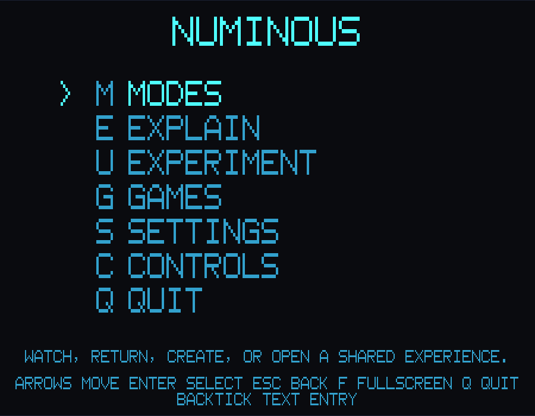
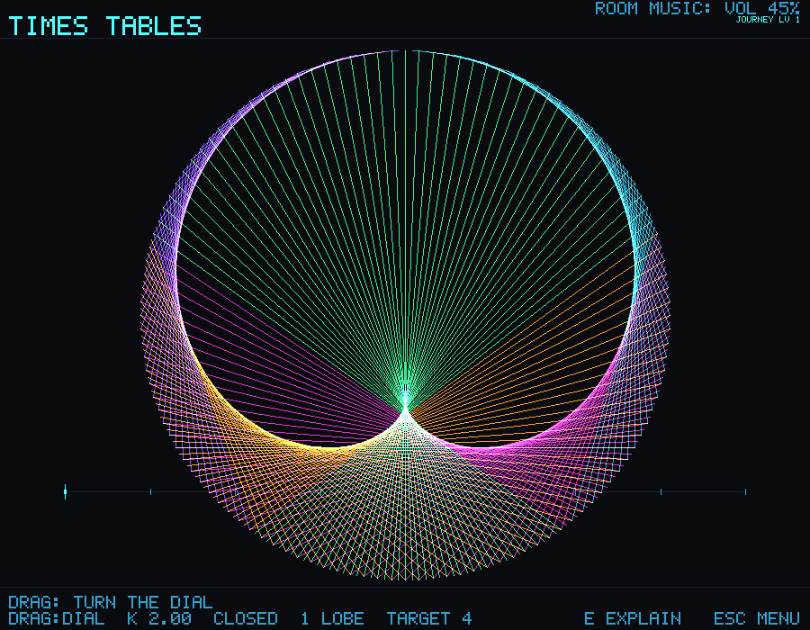
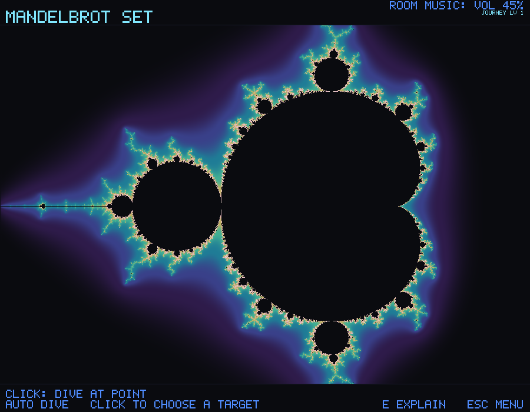
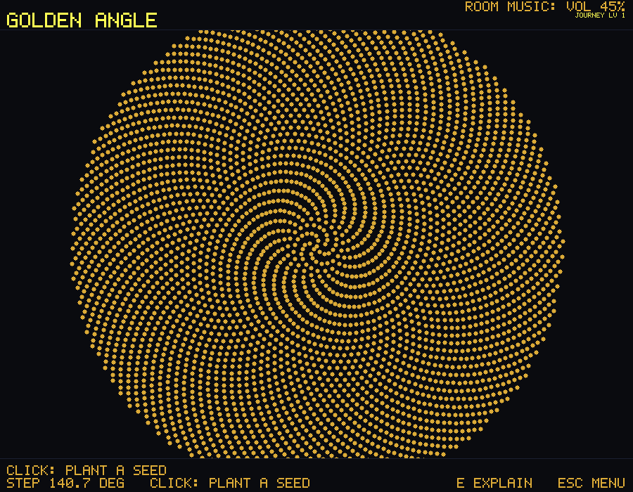
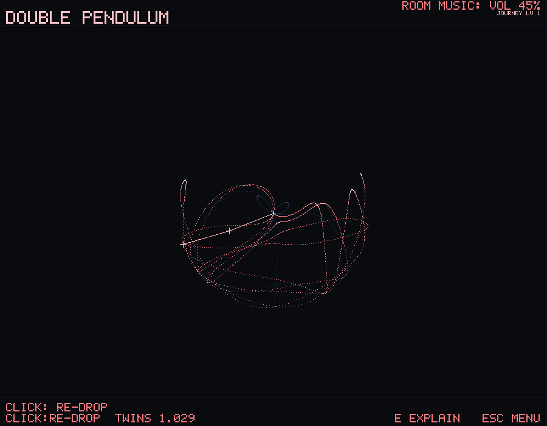
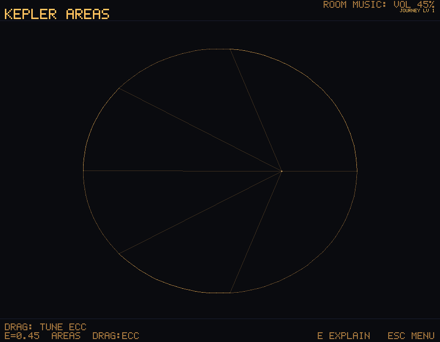
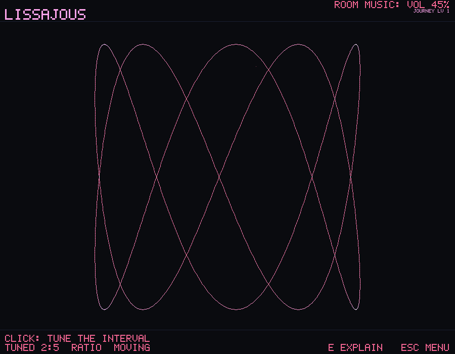
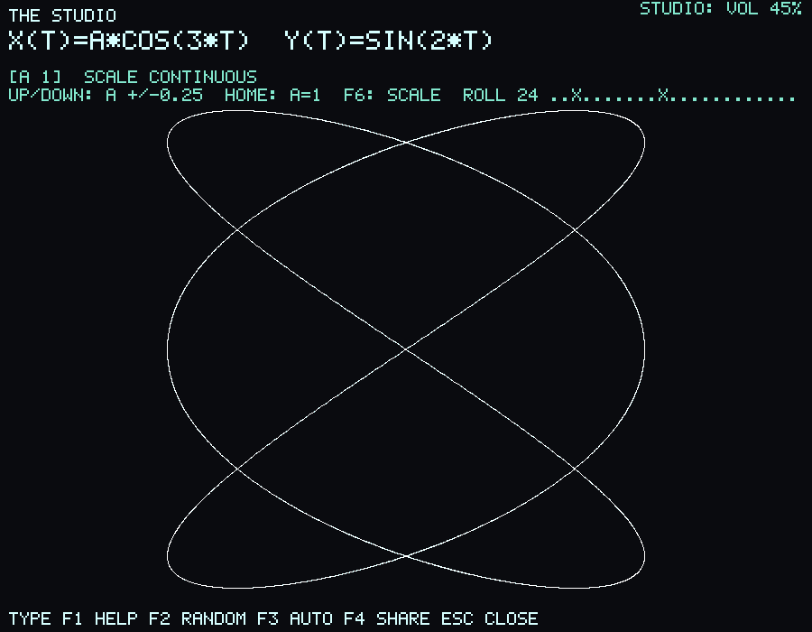

# Visuals: the rendering and look bible

How Numinous is drawn. The rule above all others: **every single frame is
screenshot-worthy.** If you pause at a random instant and it is not beautiful,
that is a bug. This document owns both the current rendering boundary and the
target visual system.

**Status (reviewed 2026-10-03).** Built: the current alpha renders every room
deterministically through CPU `Surface` implementations and presents app frames
with `softbuffer`. Mandelbrot and Julia alone have targeted `wgpu` paths. Four
CPU-styled Eras ship: phosphor, 8-bit, vector, and modern. PNG room renders,
gallery sheets, app postcards, and short-loop APNG bundles ship. Room changes
fade through the stage, and drag dials and Studio knobs use critically damped
springs. Room scores wash into the shared reverb during the fade. Designed,
not current evidence: HDR, bloom, feedback persistence, a universal GPU
pipeline, the one ink table below, 16-bit and blueprint Eras,
audio voice swaps, longer video export, and operating-system URL registration.

## App gallery

These deterministic frames use the same room, HUD, and Cabinet composition as
the live App. They show the current CPU-rendered presentation; they are not
evidence of GPU performance or the target bloom pipeline.



| | |
|---|---|
|  |  |
| Turn the dial. | Dive the set. |
|  |  |
| Pack a sunflower. | Fling the arms. |
|  |  |
| Equal times, equal areas. | Tune a relationship. |



Studio lets you make and share a relationship of your own. Its
[bundled experiments](STUDIO.md#bundled-experiments) provide starting points.
The [Route Lab guide](ROUTE_LAB.md) shows its delivery map and search playback.

## Philosophy

- **The math draws itself.** We render the mathematical object rather than a
  prerecorded texture. Most rooms compute on the CPU today; the two shipped
  fractal GPU paths evaluate escape-time fields in WGSL.
- **Lit from within, not lit from above.** The aesthetic is additive light on a near-black stage (see `DESIGN.md`), not flat UI and not photorealism. Think glowing lines and points, HDR bloom, phosphor. The image looks *emissive*.
- **Restraint is the style.** One idea per screen, one primary accent, generous negative space. A continuous field may use a color ramp tied to its measured scalar, with lightness carrying the same order. Beauty comes from precision and motion, not from clutter or spectacle.
- **Meaning lives in shape and lightness; hue is a second voice.** Where a mark sits and how bright it is carry what is true. Hue may repeat, sharpen, or beautify that meaning, never carry it alone: the Phosphor Era maps every pixel to green luminance, so hue-only meaning is erased for anyone who picks it. `DESIGN.md` states the law; the mark vocabulary below carries it.
- **Beauty in stillness and in motion.** Both the paused frame and the animation must be gorgeous. Much of the magic lives in smooth, eased, continuous motion at a locked 60fps (120 where the display allows).

## Design continuity gate

New rooms, overlays, menus, and Studio views must feel like one Numinous
instrument, not a collection of individually polished skins. Review every new
visual surface against these invariants:

- Keep the near-black stage, luminous geometry, and generous negative space.
  Use one primary room accent. Additional hue must encode real state.
- Give one mathematical idea visual priority. Controls and explanation support
  that idea without competing with it.
- Reuse shared typography, spacing, chrome, palette, Era, and motion primitives
  before introducing a local treatment.
- Keep Cabinet text on whole pixel scales and derive desktop scale from the
  viewport. The selected description, Controls reference, and command legend
  must remain comfortably readable in fullscreen, never collapse into tiny
  utility text, and never overlap the selectable rows.
- Use the Cabinet's wide 7 by 7 cartridge face for its title, choices,
  descriptions, values, Controls reference, and legend. The compact 5 by 7 HUD
  face remains appropriate where room chrome must leave the art primary.
- Use the shared Unicode reader for study prose and mathematical notation.
  Preserve case, combining characters, and scientific symbols; do not squeeze
  a derivation into the uppercase HUD or place it over the active room art.
- Make motion causal, continuous, and restrained. A quieter reduced-motion
  treatment must preserve the same information and visual hierarchy.
- Check the default frame, compact frame, and at least one consequential
  interaction state. Pair color with shape, brightness, or text so meaning does
  not depend on hue alone: meaning lives in shape and lightness, and hue is a
  second voice.

These are continuity requirements, not evidence that the planned 0.5
accessibility and human visual-review gates have already passed.

## The mark vocabulary and its inks

Rooms draw through `Surface`. Stroke geometry uses `Surface::plot(mark)`, and
each face turns the mark into its own medium: the terminal face into a character,
and `Raster::ink` into an RGB value added to the pixel. A continuous sampled
field can use `Surface::paint` to pair an exact pixel color with a text mark.
The law in `DESIGN.md`
decides what the marks must carry: **meaning lives in shape and lightness; hue
is a second voice.** Two marks that mean different things must stay apart in
shape or lightness even with the hue taken away, as the Phosphor Era takes it.

**Built today (`Raster::ink`):**

| Mark | Pixel ink |
|---|---|
| `'#'` | the room accent times 1.7 |
| `'!'` | warning ink `[230, 72, 72]` |
| `'-'` | structure ink `[16, 20, 34]` |
| `'@'`, `'%'`, `'&'`, `'~'` | the four spectral inks `[216, 40, 190]`, `[56, 224, 132]`, `[242, 148, 36]`, `[116, 72, 232]` |
| every other mark, including `' '` | the room accent |

The terminal reads `' ' . : + * #` as an ordered weight ramp, but the pixel
face paints all of those except `'#'` at the same full accent. That flattening
is why some rooms read as one flat tone in the App, a PNG, a postcard, or the
Gallery while their character face still shows structure. The related
color-independence limits are measured in the roadmap's decisions section.

**Designed, not built: one ink table for every face.** The pixel face should
speak the terminal's weight ramp:

| Mark | Role | Pixel ink |
|---|---|---|
| `' '` | empty | nothing (plotting it is a no-op) |
| `'.'`, `':'` | faint: guides, the unlit field, older history | accent x 0.35 |
| `'-'` | chrome structure | fixed `[16, 20, 34]` (unchanged) |
| `'+'`, `'x'`, `'='` | secondary | accent x 0.6 |
| `'*'`, `'o'`, and other marks | the idea | accent x 1.0 |
| `'#'` | hot core, emphasis | accent x 1.7 now; tone-mapped toward white after the Sensory Lift |
| `'!'` | wrong, always with a shape cue | `[230, 72, 72]` |
| `'@'`, `'%'`, `'&'`, `'~'` | spectral state | unchanged until the spectral ruling (decisions entry 12) |

With it comes one guard: for every room that draws two marks with different
roles, the raster must render them distinguishably. The terminal shade steps
in `ansi.rs`, measured quartiles of today's ink, are re-derived from the new
table. Because it changes every golden image, the table lands inside the
Sensory Lift's one deliberate visual re-baseline, together
with an accent lightness band that keeps every room's accent bright enough to
glow on the stage.

## Current and target render pipelines

The current shared seam is `Surface`: each room emits deterministic drawing
operations that can become terminal cells or RGBA pixels. The app presents the
RGBA raster, adaptively reducing live resolution when a room exceeds its 33 ms
budget. The GPU adapter can replace the fractal raster for Mandelbrot and Julia
using a primary graphics backend first; offscreen OpenGL is initialized only
when no primary adapter is available. Native HDR surfaces use primary backends.
This avoids initializing a secondary driver unnecessarily: a local Windows
probe rendered on Vulkan but crashed in AMD's OpenGL teardown. Repeated primary
backend probes rendered and exited cleanly. These are local observations, not
the pending physical-platform receipts. CPU fallback and deterministic exports
remain available. Mandelbrot uses one
core-owned smooth escape-time palette on both CPU and GPU: violet, indigo,
teal, amber, rose, and pale highlights, ordered by increasing lightness. The
outer field eases into the uniform near-black stage, with no bright cutoff
band. Samples still bounded at the iteration limit share the dark stage. Its
native camera keeps advancing after a click rather than snapping back at a
normalized phase boundary. Julia retains
its separate palette and interaction identity.
Times Tables uses five fixed spectral chord families on the shared additive
raster. Their hue identifies source-circle regions, while crossings brighten
naturally. A resolution-aware sample count preserves negative space in ASCII
without changing the 240-point mathematical circle used by full-size raster
frames. Its in-scene dial draws explicit ticks and a bright current marker.

The gallery's deterministic Mandelbrot plate uses the same continuous color
field as the App fallback and PNG exports. The text surface keeps its ordered
escape-time marks. Pixel surfaces replace field samples through `Surface::paint`
rather than reducing them to accent marks. CPU and GPU compute their orbits at
different precision, so intricate boundary pixels can differ; sharing the
palette does not establish identical deep-zoom geometry or display pacing.

The App study reader is a separate, opaque reading surface on the same
near-black stage. Bundled Noto Sans, Noto Sans JP, and Noto Sans Math supply
case-preserving prose and linear mathematical notation. Measured text wraps
inside a clipped, scrollable body; depth, language, and return controls stay
fixed. Body text offers persisted 100, 125, and 150 percent sizes through
Settings and reader controls. Source positions anchor resizing and size
changes, and the room's clock and accepted
input history are held while reading. Cabinet menus, room HUD lettering,
and the pause, banner, and journey overlays share a saved Interface Text size
of 100, 125, or 150 percent of the window's own pixel scale. One hundred
percent is that existing scale. A larger choice rounds half up, by at least
one pixel step, and each surface then reduces it until titles, status, and
controls stay inside the window. Gallery, games, Studio, and in-room pictures
keep their own layout scales.
The room header reserves separate space for titles, Journey progress, and
audio status. Titles reduce their pixel scale to fit beside progress before
truncating; Show title cards use the same fit rule. Spectrum bars sit below
progress inside the reserved header strip. Composition checks preserve every catalog title in a 360 by 240
frame with the largest Journey value and active audio indicators, while
retaining the room's own readouts and footer controls. This fixes header
collisions; it does not close the general text scaling work.

This reading boundary does not add Unicode naming or IME editing to Studio,
translate the full App shell, or provide complete Unicode glyph coverage. It
does not typeset stacked fractions or other two-dimensional equations. Bundled
glyph coverage and authored translation coverage are separate limits.
[Study](STUDY.md) owns supported content, fallback, controls, and translation
review status.

The target systemic GPU post-stack has five stages:

1. **Compute pass:** run only measured simulations or fields that benefit from
   GPU parallelism.
2. **Scene pass:** draw line, point, field, or SDF primitives into an HDR target.
3. **Post pass:** apply bright-pass bloom, tone mapping, and a restrained grade.
4. **Era filter:** express an Era as a shared post-process where that can replace
   per-face duplication without erasing room meaning.
5. **Capture tap:** export deterministic stills and, later, bounded loops from a
   defined pre-grade or post-grade surface.

## The identity mark

The current mark is a cyan circle with one open horizontal band. A broad gap
survives at small sizes; the circle connects it to the rooms while the existing
cartridge wordmark remains the name. Keep the mark simple, without decorative
glyphs, hidden letters, or extra orbiting elements.

`assets/logo.svg` is the vector source. Its cyan `#4effff` is the identity hue,
on the shared `#0a0b0f` stage. The Cabinet draws its highlight in the waiting
room's accent today, so it matches the mark only when that room is Times
Tables; one fixed chrome palette with the cyan as its only identity hue is
Designed. Windows, macOS, and Linux use the PNG,
ICO, and ICNS assets derived from that source. The transparent corners and
dark backing preserve the silhouette on either light or dark desktops.

Regenerate from the repository root with Node.js installed:

```text
npm install --prefix .agent/logo-tools --save-exact @resvg/resvg-js@2.6.2
node scripts/render-logo.mjs
node scripts/render-logo.mjs --check
```

The package stays in the ignored working directory. ICO contains separate
16, 20, 24, 32, 48, 64, 128, and 256 pixel renders; ICNS carries the 256 pixel
PNG. Check the smallest sizes, monochrome silhouette, and the mark beside
the cartridge wordmark when changing it. These files do not add a runtime
renderer or font dependency.

## Target technique toolbox

These techniques are candidates for the staged GPU system, not a list of
already shipped room implementations.

- **Signed distance fields (SDF) + raymarching.** The workhorse for 3D and 4D scenes: define shapes as distance functions, march rays per pixel. Intuitive to build and blend, and pure math all the way down (reference: Inigo Quilez's articles are the canon). Used for 4D objects, hyperbolic space, smooth organic forms.
- **Smooth-minimum blending.** `smin` to melt SDF shapes into each other for the organic, liquid look (reaction-diffusion coral, L-system growth).
- **Domain coloring.** For complex-valued functions (Riemann zeta, complex maps), map the output's angle to hue and magnitude to brightness, so a whole function becomes one glowing image and its zeros become visible.
- **Additive / HDR line and point rendering.** Thousands to millions of translucent, additively-blended primitives that sum into light where they overlap (the times-table bloom, prime fields, Fourier trails, Galton particles). This *is* the signature look.
- **Feedback buffers (ping-pong).** Render into a texture that decays each frame for trails, phosphor persistence, and the reaction-diffusion and Game-of-Life simulations themselves.
- **Procedural palettes.** Cosine-based palette functions (again the IQ technique) for smooth, tunable, GPU-cheap color ramps that map a scalar (pitch, phase, iteration count) to color.
- **GPU instancing and particles.** One draw call for a million elements; essential for the emergence rooms.

## The color system

Color is data, never decoration. Rules:

- **Near-black stage.** Deep near-black background (around `#0a0b0f`), never pure black, so glow has somewhere to sit.
- **One accent per room by default.** Each room owns a signature accent that
  glows. A deliberate spectral mapping may add a small shared palette when hue
  carries real state, as the source-circle families do in Times Tables.
- **Color carries meaning.** Hue maps to a real quantity, pitch, phase, iteration-to-escape, curvature, so the color *is* information you can read, not styling.
- **Perceptually uniform ramps.** Use perceptually-uniform colormaps (viridis-family) for scalar fields so equal steps in value look like equal steps in color, and so it stays honest.
- **HDR for emission, planned.** Accent values above 1.0 will drive the future
  bloom pass. The current raster approximates glow in 8-bit color.
- **Accessible by construction, required.** Validate every palette for contrast
  and color-vision deficiencies, and pair hue with brightness or shape. That
  complete validation has not happened yet and remains in the 0.5 gate.

## Mark lightness and the accent band (Built)

The core owns both contracts in `palette` and `Raster::MarkRole`. Room accents
keep CIELAB lightness from 40 to 72 and at least 3:1 contrast against the
near-black stage. Accents outside the band were moved at the same CIELAB hue,
reducing chroma only when the sRGB gamut required it. Every catalog and hidden
accent is checked; these are graphical contrast measurements, not a claim
that every text face or display is accessible.

| Marks | Role | Accent multiplier |
| --- | --- | --- |
| `.` `:` | Faint guide | 0.35 |
| `+` `x` `=` | Secondary detail | 0.6 |
| `*` `o` and other ordinary marks | Main idea | 1.0 |
| `#` | Hot highlight | 1.7 |

Spaces draw nothing. Rules use a fixed dark structural ink; warning and spectral
marks retain their semantic inks. The terminal keeps the original characters,
while the raster uses their roles for lightness. App footer and audio labels
use main-idea ink so reducing guide lightness does not dim readable controls.
Mandelbrot's sampled color field remains independent of the mark ramp.

Fixed mono thresholds follow the rendered catalog rather than adapting per
frame. Sweeps require distinct drawn accent levels, increasing lightness, and
visible pixel touch responses through the same mono renderer players use.
Hilbert's focus is a lit neighborhood, Percolation leaves closed sites dark
and exposes a shortest left-to-right crossing with distinct text marks and
pixel brightness, and Wireworld's conductor,
head, and tail use different roles. The audit in
`evidence/color-independence.json` is regenerated from current room sources;
remaining warning and spectral collisions are still recorded in the roadmap.
Flagship image goldens are deliberately rebased for this shared rendering
change. The existing audio golden metrics remain unchanged. This software
rendering contract does not promote the optional GPU post stack without its
closed physical pacing set.

The adjusted Rule 30 accent exposed a fast-speed flash in its automatic rule
gallery. Ambient growth now keeps Rule 30 and variations move the seed;
choosing other rule bytes remains an explicit hand action. The full-catalog
flash sweep checks this change against the existing shrink-only budget.

## Target motion design

Rooms currently animate deterministically from phase, and the app can reduce
live render resolution to protect its 33 ms room budget. The rules below are the
remaining product bar, not claims that every room already satisfies it.

- **Everything eases.** Nothing snaps. Physical, continuous, momentum-based. Dials have inertia; values glide.
- **Idle "breathing."** A room left alone never freezes; it drifts in a slow, generative, gorgeous idle loop (this is also what makes Watch mode work, see `DESIGN.md`).
- **Transitions dip through the stage (Built).** Every App room change dims
  the last presented room to the near-black stage over 0.2 seconds, then raises
  the arriving room over 0.35 seconds. Reduced motion uses a plain 0.08-second
  fade out and 0.12-second fade in. Presentation time sets the duration at any
  refresh rate. Repeated changes keep dimming and wait at the stage when needed
  to space arrivals at least 0.5 seconds apart. A deterministic full-white
  sweep checks the transition against the photosensitivity budget; this does
  not certify the moving content of the rooms themselves. Room-score washes
  share the fade duration; rapid changes use a short, continuous audio
  interruption. Radio keeps playing. Audio and presentation clocks remain
  separate (`SOUND.md`).
- **Dials glide (Built).** Drag dials and Studio knobs follow critically damped
  springs without overshooting. Accepted input, grading, saved creations,
  postcards, and sound retain exact written values; the room readout follows
  the presented dial. At rest the drawn value is exact. Holds, clicks, flings,
  persistent edits, and reduced-motion input apply immediately.
- **Motion writes light.** Phosphor persistence leaves a decaying trail behind what moves, the visual rhyme of reverb.
- **A live number on the frame.** The room's status readout is the instrument's display; keeping it present in every mode and Era is part of the look.
- **Frame budget.** Work toward smooth display pacing on representative
  hardware. The current evidence is the adaptive 33 ms room-render budget on
  one Windows machine, not a universal 60 or 120 fps guarantee.
- **Reduce-motion is real.** Reduced motion holds each room at its best still phase, keeps touch answering, never shakes the screen, and never strobes or zooms aggressively. It stays beautiful, not a degraded fallback. Holding the phase still, a held Show that waits for the player, and a still frame edge in place of a screen shake are built.

## Rendering the Visual Eras

Four Eras ship as deterministic CPU styling in the app, CLI, and PNG paths:

- **Phosphor:** a green character-display treatment.
- **8-bit:** a small-palette, chunky-pixel treatment.
- **Vector:** a sparse line-forward treatment inspired by an oscilloscope.
- **Modern:** the native near-black and single-accent raster look.

The fuller CRT effects, feedback persistence, 16-bit and blueprint treatments,
HDR modern pass, and per-Era audio voices are planned. Era progression must not
be described as complete until those visual and sonic variants are both built
and tested.

## Per-wing visual identity

The shared pipeline guarantees coherence; these keep the wings distinct. They are
designed for the six original wings; the catalog files its rooms under 13 wings
today, and these identities will follow the wing ruling (`ROOMS.md`):
- **Emergence:** dense fields and grids, particle clouds, feedback trails. Cellular, alive.
- **Waves & Sound:** flowing lines, oscilloscope-native, waveforms and phase. Fluid.
- **Infinity & Fractals:** deep zoom, domain coloring, raymarched recursion. Vertiginous.
- **Number & Pattern:** points on circles and spirals, chords of light, discrete dots. Crystalline.
- **Shape & Space:** raymarched SDF solids, clean geometry, 3D/4D. Architectural.
- **Chance & Order:** many small particles accumulating into a whole. Statistical, granular.

## Export & capture

- **Shipped:** deterministic CPU PNG renders, full catalog galleries and contact
  sheets, and app postcards of the live room state.
- **Separate shipped artifacts:** Studio `.num` files and matching links round
  trip through all three faces. The App opens files and links through launch
  arguments and file drops, preserving the saved numerical state in a paused
  preview. Shared bundles also carry the postcard and melody MIDI.
- **Planned:** HDR still capture after that pipeline exists, longer video
  export, and operating-system registration of the native URL scheme.

## Open questions
1. Bloom approach: physically-based HDR bloom vs. a cheaper stylized glow, per performance budget on integrated GPUs.
2. Deep-zoom precision for Mandelbrot: when to switch from f32 to emulated double-double / perturbation, and whether that forces a dedicated render path.
3. How aggressively the CRT/dither Eras can run on low-end hardware without dropping the 60fps floor.
4. One global grade vs. per-wing grades: how much color identity each wing gets before coherence suffers.
